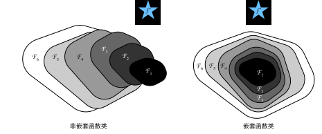
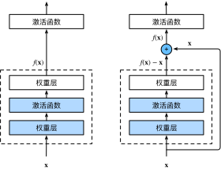

# 残差网络（ResNet）
:label:`sec_resnet`

随着我们设计越来越深的网络，了解添加层如何增加网络的复杂性和表现力变得越来越重要。更重要的是设计网络的能力，在这种网络中，添加层会使网络更具表现力，而不仅仅是与众不同。为了取得一些进展，我们需要一些数学知识。

## 函数类

考虑$\mathcal{F}$，一种特定网络架构（连同学习速率和其他超参数设置）可以达到的功能类别。也就是说，对于所有$f \in \mathcal{F}$，存在一些参数集（例如权重和偏差），这些参数可以通过在合适的数据集上进行训练而获得。让我们假设$f^*$是我们真正想要找到的“真相”函数。如果是$\mathcal{F}$，我们的状态很好，但通常我们不会那么幸运。相反，我们将尝试找到一些$f^*_\mathcal{F}$，这是我们在$\mathcal{F}$中的最佳选择。例如，给定一个具有$\mathbf{X}$特性和$\mathbf{y}$标签的数据集，我们可以尝试通过解决以下优化问题来找到它：

$$f^*_\mathcal{F} := \mathop{\mathrm{argmin}}_f L(\mathbf{X}, \mathbf{y}, f) \text{ subject to } f \in \mathcal{F}.$$

只有合理的假设是，如果我们设计一个不同的、更强大的体系结构$\mathcal{F}'$，我们将获得更好的结果。换句话说，我们预计$f^*_{\mathcal{F}'}$比$f^*_{\mathcal{F}}$“更好”。然而，如果$\mathcal{F} \not\subseteq \mathcal{F}'$，则无法保证这种情况会发生。事实上，$f^*_{\mathcal{F}'}$可能更糟。如:numref:`fig_functionclasses`所示，对于非嵌套函数类，较大的函数类并不总是向“真”函数$f^*$靠拢。例如，在:numref:`fig_functionclasses`的左边，虽然$\mathcal{F}_3$比$f^*$更接近$f^*$，但$\mathcal{F}_6$却离开了，并且不能保证进一步增加复杂性可以减少与$f^*$的距离。对于嵌套函数类:numref:`fig_functionclasses`右侧的$\mathcal{F}_1 \subseteq \ldots \subseteq \mathcal{F}_6$，我们可以从非嵌套函数类中避免上述问题。


:label:`fig_functionclasses`

因此，只有当较大的函数类包含较小的函数类时，我们才能保证增加它们严格地增加网络的表达能力。对于深度神经网络，如果我们能将新增加的层训练成一个识别函数$f(\mathbf{x}) = \mathbf{x}$，新模型将与原模型一样有效。由于新模型可能会得到更好的解决方案来适应训练数据集，因此增加的层可能会更容易减少训练误差。

这是他等人提出的问题。当工作在非常深的计算机视觉模型:cite:`He.Zhang.Ren.ea.2016`。他们提出的“残差网络”（*ResNet*）的核心思想是，每个附加层都应该更容易地包含身份函数作为其元素之一。这些考虑是相当深刻的，但他们导致了一个惊人的简单的解决方案，一个*剩余块*。凭借它，ResNet赢得了2015年ImageNet大规模视觉识别挑战赛。这个设计对如何建立深层神经网络产生了深远的影响。

## 残差块

让我们关注神经网络的局部部分，如:numref:`fig_residual_block`所示。用$\mathbf{x}$表示输入。我们假设我们希望通过学习获得的所需底层映射是$f(\mathbf{x})$，用作顶部激活函数的输入。在:numref:`fig_residual_block`的左边，虚线框内的部分必须直接学习映射$f(\mathbf{x})$。在右边，虚线框内的部分需要学习*残差映射*$f(\mathbf{x}) - \mathbf{x}$，这就是残差块如何获得其名称的。如果身份映射$f(\mathbf{x}) = \mathbf{x}$是所需的底层映射，则残差映射更容易学习：我们只需将虚线框内上部权重层（例如，完全连接层和卷积层）的权重和偏差推到零。:numref:`fig_residual_block`中的右图说明了ResNet的*剩余块*，其中携带层输入$\mathbf{x}$到加法运算符的实线称为*剩余连接*（或*快捷连接*）。使用剩余块，输入可以通过层间的剩余连接更快地向前传播。


:label:`fig_residual_block`

ResNet遵循VGG的完整$3\times 3$卷积层设计。剩余块具有两个$3\times 3$个卷积层，具有相同数量的输出信道。每个卷积层后面是一个批处理规范化层和一个ReLU激活函数。然后，我们跳过这两个卷积运算，直接在最终的ReLU激活函数之前添加输入。这种设计要求两个卷积层的输出必须与输入具有相同的形状，以便将它们相加。如果我们想要改变通道的数量，我们需要引入一个额外的$1\times 1$卷积层来将输入转换成加法运算所需的形状。让我们看看下面的代码。

```{.python .input}
from d2l import mxnet as d2l
from mxnet import np, npx
from mxnet.gluon import nn
npx.set_np()

class Residual(nn.Block):  #@save
    def __init__(self, num_channels, use_1x1conv=False, strides=1, **kwargs):
        super().__init__(**kwargs)
        self.conv1 = nn.Conv2D(num_channels, kernel_size=3, padding=1,
                               strides=strides)
        self.conv2 = nn.Conv2D(num_channels, kernel_size=3, padding=1)
        if use_1x1conv:
            self.conv3 = nn.Conv2D(num_channels, kernel_size=1,
                                   strides=strides)
        else:
            self.conv3 = None
        self.bn1 = nn.BatchNorm()
        self.bn2 = nn.BatchNorm()

    def forward(self, X):
        Y = npx.relu(self.bn1(self.conv1(X)))
        Y = self.bn2(self.conv2(Y))
        if self.conv3:
            X = self.conv3(X)
        return npx.relu(Y + X)
```

```{.python .input}
#@tab pytorch
from d2l import torch as d2l
import torch
from torch import nn
from torch.nn import functional as F

class Residual(nn.Module):  #@save
    def __init__(self, input_channels, num_channels,
                 use_1x1conv=False, strides=1):
        super().__init__()
        self.conv1 = nn.Conv2d(input_channels, num_channels,
                               kernel_size=3, padding=1, stride=strides)
        self.conv2 = nn.Conv2d(num_channels, num_channels,
                               kernel_size=3, padding=1)
        if use_1x1conv:
            self.conv3 = nn.Conv2d(input_channels, num_channels,
                                   kernel_size=1, stride=strides)
        else:
            self.conv3 = None
        self.bn1 = nn.BatchNorm2d(num_channels)
        self.bn2 = nn.BatchNorm2d(num_channels)
        self.relu = nn.ReLU(inplace=True)

    def forward(self, X):
        Y = F.relu(self.bn1(self.conv1(X)))
        Y = self.bn2(self.conv2(Y))
        if self.conv3:
            X = self.conv3(X)
        Y += X
        return F.relu(Y)
```

```{.python .input}
#@tab tensorflow
from d2l import tensorflow as d2l
import tensorflow as tf

class Residual(tf.keras.Model):  #@save
    def __init__(self, num_channels, use_1x1conv=False, strides=1):
        super().__init__()
        self.conv1 = tf.keras.layers.Conv2D(
            num_channels, padding='same', kernel_size=3, strides=strides)
        self.conv2 = tf.keras.layers.Conv2D(
            num_channels, kernel_size=3, padding='same')
        self.conv3 = None
        if use_1x1conv:
            self.conv3 = tf.keras.layers.Conv2D(
                num_channels, kernel_size=1, strides=strides)
        self.bn1 = tf.keras.layers.BatchNormalization()
        self.bn2 = tf.keras.layers.BatchNormalization()

    def call(self, X):
        Y = tf.keras.activations.relu(self.bn1(self.conv1(X)))
        Y = self.bn2(self.conv2(Y))
        if self.conv3 is not None:
            X = self.conv3(X)
        Y += X
        return tf.keras.activations.relu(Y)
```

此代码生成两种类型的网络：一种是在`use_1x1conv=False`应用ReLU非线性之前将输入添加到输出，另一种是在添加之前通过$1 \times 1$卷积调整信道和分辨率。:numref:`fig_resnet_block`说明了这一点：


:label:`fig_resnet_block`

现在让我们看看输入和输出是相同形状的情况。

```{.python .input}
blk = Residual(3)
blk.initialize()
X = np.random.uniform(size=(4, 3, 6, 6))
blk(X).shape
```

```{.python .input}
#@tab pytorch
blk = Residual(3,3)
X = torch.rand(4, 3, 6, 6)
Y = blk(X)
Y.shape
```

```{.python .input}
#@tab tensorflow
blk = Residual(3)
X = tf.random.uniform((4, 6, 6, 3))
Y = blk(X)
Y.shape
```

我们还可以选择将输出高度和宽度减半，同时增加输出通道的数量。

```{.python .input}
blk = Residual(6, use_1x1conv=True, strides=2)
blk.initialize()
blk(X).shape
```

```{.python .input}
#@tab pytorch
blk = Residual(3,6, use_1x1conv=True, strides=2)
blk(X).shape
```

```{.python .input}
#@tab tensorflow
blk = Residual(6, use_1x1conv=True, strides=2)
blk(X).shape
```

## ResNet模型

ResNet的前两层与我们前面描述的GoogLeNet是相同的：$7\times 7$卷积层有64个输出通道，步长为2，后面是$3\times 3$最大池层，步长为2。区别是在ResNet中每个卷积层之后添加的批处理规范化层。

```{.python .input}
net = nn.Sequential()
net.add(nn.Conv2D(64, kernel_size=7, strides=2, padding=3),
        nn.BatchNorm(), nn.Activation('relu'),
        nn.MaxPool2D(pool_size=3, strides=2, padding=1))
```

```{.python .input}
#@tab pytorch
b1 = nn.Sequential(nn.Conv2d(1, 64, kernel_size=7, stride=2, padding=3),
                   nn.BatchNorm2d(64), nn.ReLU(),
                   nn.MaxPool2d(kernel_size=3, stride=2, padding=1))
```

```{.python .input}
#@tab tensorflow
b1 = tf.keras.models.Sequential([
    tf.keras.layers.Conv2D(64, kernel_size=7, strides=2, padding='same'),
    tf.keras.layers.BatchNormalization(),
    tf.keras.layers.Activation('relu'),
    tf.keras.layers.MaxPool2D(pool_size=3, strides=2, padding='same')])
```

GoogLeNet使用了由Inception块组成的四个模块。然而，ResNet使用由剩余块组成的四个模块，每个模块使用具有相同数量输出信道的几个剩余块。第一个模块中的通道数与输入通道数相同。由于已经使用了跨距为2的最大池层，因此不必减小高度和宽度。在每个后续模块的第一剩余块中，与前一模块相比，信道数量增加了一倍，并且高度和宽度减半。

现在，我们实现这个模块。注意，对第一个模块执行了特殊处理。

```{.python .input}
def resnet_block(num_channels, num_residuals, first_block=False):
    blk = nn.Sequential()
    for i in range(num_residuals):
        if i == 0 and not first_block:
            blk.add(Residual(num_channels, use_1x1conv=True, strides=2))
        else:
            blk.add(Residual(num_channels))
    return blk
```

```{.python .input}
#@tab pytorch
def resnet_block(input_channels, num_channels, num_residuals,
                 first_block=False):
    blk = []
    for i in range(num_residuals):
        if i == 0 and not first_block:
            blk.append(Residual(input_channels, num_channels,
                                use_1x1conv=True, strides=2))
        else:
            blk.append(Residual(num_channels, num_channels))
    return blk
```

```{.python .input}
#@tab tensorflow
class ResnetBlock(tf.keras.layers.Layer):
    def __init__(self, num_channels, num_residuals, first_block=False,
                 **kwargs):
        super(ResnetBlock, self).__init__(**kwargs)
        self.residual_layers = []
        for i in range(num_residuals):
            if i == 0 and not first_block:
                self.residual_layers.append(
                    Residual(num_channels, use_1x1conv=True, strides=2))
            else:
                self.residual_layers.append(Residual(num_channels))

    def call(self, X):
        for layer in self.residual_layers.layers:
            X = layer(X)
        return X
```

然后，我们将所有模块添加到ResNet中。这里，每个模块使用两个剩余块。

```{.python .input}
net.add(resnet_block(64, 2, first_block=True),
        resnet_block(128, 2),
        resnet_block(256, 2),
        resnet_block(512, 2))
```

```{.python .input}
#@tab pytorch
b2 = nn.Sequential(*resnet_block(64, 64, 2, first_block=True))
b3 = nn.Sequential(*resnet_block(64, 128, 2))
b4 = nn.Sequential(*resnet_block(128, 256, 2))
b5 = nn.Sequential(*resnet_block(256, 512, 2))
```

```{.python .input}
#@tab tensorflow
b2 = ResnetBlock(64, 2, first_block=True)
b3 = ResnetBlock(128, 2)
b4 = ResnetBlock(256, 2)
b5 = ResnetBlock(512, 2)
```

最后，就像GoogLeNet一样，我们添加了一个全局平均池层，然后是完全连接的层输出。

```{.python .input}
net.add(nn.GlobalAvgPool2D(), nn.Dense(10))
```

```{.python .input}
#@tab pytorch
net = nn.Sequential(b1, b2, b3, b4, b5,
                    nn.AdaptiveAvgPool2d((1,1)),
                    nn.Flatten(), nn.Linear(512, 10))
```

```{.python .input}
#@tab tensorflow
# Recall that we define this as a function so we can reuse later and run it
# within `tf.distribute.MirroredStrategy`'s scope to utilize various
# computational resources, e.g. GPUs. Also note that even though we have
# created b1, b2, b3, b4, b5 but we will recreate them inside this function's
# scope instead
def net():
    return tf.keras.Sequential([
        # The following layers are the same as b1 that we created earlier
        tf.keras.layers.Conv2D(64, kernel_size=7, strides=2, padding='same'),
        tf.keras.layers.BatchNormalization(),
        tf.keras.layers.Activation('relu'),
        tf.keras.layers.MaxPool2D(pool_size=3, strides=2, padding='same'),
        # The following layers are the same as b2, b3, b4, and b5 that we
        # created earlier
        ResnetBlock(64, 2, first_block=True),
        ResnetBlock(128, 2),
        ResnetBlock(256, 2),
        ResnetBlock(512, 2),
        tf.keras.layers.GlobalAvgPool2D(),
        tf.keras.layers.Dense(units=10)])
```

每个模块有4个卷积层（不包括$1\times 1$卷积层）。加上第一个$7\times 7$卷积层和最后一个全连通层，共有18个层。因此，这种模型通常被称为ResNet-18。通过在模块中配置不同数量的信道和剩余块，我们可以创建不同的ResNet模型，例如更深的152层ResNet-152。虽然ResNet的主要架构与GoogLeNet相似，但是ResNet的结构更简单、更容易修改。所有这些因素导致ResNet的迅速和广泛的使用。:numref:`fig_resnet18`描述了完整的ResNet-18。


:label:`fig_resnet18`

在训练ResNet之前，让我们观察一下ResNet中不同模块的输入形状是如何变化的。在所有以前的架构中，分辨率降低，而通道数量增加，直到全局平均池层聚集所有特性为止。

```{.python .input}
X = np.random.uniform(size=(1, 1, 224, 224))
net.initialize()
for layer in net:
    X = layer(X)
    print(layer.name, 'output shape:\t', X.shape)
```

```{.python .input}
#@tab pytorch
X = torch.rand(size=(1, 1, 224, 224))
for layer in net:
    X = layer(X)
    print(layer.__class__.__name__,'output shape:\t', X.shape)
```

```{.python .input}
#@tab tensorflow
X = tf.random.uniform(shape=(1, 224, 224, 1))
for layer in net().layers:
    X = layer(X)
    print(layer.__class__.__name__,'output shape:\t', X.shape)
```

## 训练 ResNet

同之前一样，我们在 Fashion-MNIST 数据集上训练 ResNet。

```{.python .input}
#@tab all
lr, num_epochs, batch_size = 0.05, 10, 256
train_iter, test_iter = d2l.load_data_fashion_mnist(batch_size, resize=96)
d2l.train_ch6(net, train_iter, test_iter, num_epochs, lr)
```

## 小结

* 嵌套函数类是理想的。在深层神经网络中学习另一层作为身份函数（尽管这是一个极端情况）应该很容易。
* 残差映射可以更容易地学习同一函数，例如将权重层中的参数推到零。
* 利用残差块可以训练出一个有效的深层神经网络。输入可以通过层间的残余连接更快地向前传播。
* ResNet对随后的深层神经网络的设计产生了重大影响，无论是卷积的还是序列的。

## 练习

1. :numref:`fig_inception`中的起始块与剩余块之间的主要区别是什么？在删除了Inception块中的一些路径之后，它们是如何相互关联的？
1. 参考ResNet论文:cite:`He.Zhang.Ren.ea.2016`中的表1，以实现不同的变体。
1. 对于更深层次的网络，ResNet引入了“瓶颈”架构来降低模型的复杂性。试着去实现它。
1. 在ResNet的后续版本中，作者将“卷积、批处理规范化和激活”结构更改为“批处理规范化、激活和卷积”结构。你自己做这个改进。详见:cite:`He.Zhang.Ren.ea.2016*1`中的图1。
1. 为什么即使函数类是嵌套的，我们为什么不能不加限制地增加函数的复杂性呢？

:begin_tab:`mxnet`
[Discussions](https://discuss.d2l.ai/t/85)
:end_tab:

:begin_tab:`pytorch`
[Discussions](https://discuss.d2l.ai/t/86)
:end_tab:

:begin_tab:`tensorflow`
[Discussions](https://discuss.d2l.ai/t/333)
:end_tab:
