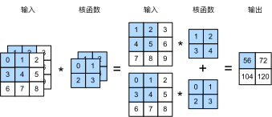
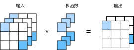

# 多输入和多输出通道
:label:`sec_channels`

虽然我们已经描述了组成每个图像的多个通道（例如，彩色图像具有标准的 RGB 通道来指示红色，绿色和蓝色的量）和卷积层 :numref:`subsec_why-conv-channels` 中多个通道，但到现在为止，我们简化了我们所有的数字示例，只需使用一个输入和单个输出通道。这使我们能够将我们的输入、卷积内核和输出视为二维张量。

当我们在混音中添加通道时，我们的输入和隐藏表示都会变成三维张量。例如，每个 RGB 输入图像的形状为 $3\times h\times w$。我们将这个尺寸为 3 的轴称为 * 通道 * 维度。在本节中，我们将深入了解具有多个输入和多个输出通道的卷积内核。

## 多个输入通道

当输入数据包含多个通道时，我们需要构建一个卷积内核，其输入通道数量与输入数据相同，以便与输入数据进行交叉相关。假设输入数据的通道数是 $c_i$，卷积内核的输入通道数也需要 $c_i$。如果卷积内核的窗口形状是 $k_h\times k_w$，那么当 $c_i=1$ 时，我们可以将卷积内核视为形状 $k_h\times k_w$ 的二维张量。

但是，当 $c_i>1$ 时，我们需要一个包含形状为 $k_h\times k_w$ 的张量的内核，用于 * 每个 * 输入通道。将这些 $c_i$ 张量连接在一起，产生形状为 $c_i\times k_h\times k_w$ 的卷积核。由于输入和卷积内核各有 $c_i$ 通道，我们可以对输入的二维张量和卷积内核的二维张量执行互相关运算，将 $c_i$ 结果加在一起（通道上的求和）产生一个二维张量运算。维张量。这是多通道输入和多输入通道卷积内核之间的二维互相关的结果。

在 :numref:`fig_conv_multi_in` 中，我们演示了一个与两个输入通道的二维互相关的示例。阴影部分是第一个输出元素以及用于输出计算的输入和核张量元素：$(1\times1+2\times2+4\times3+5\times4)+(0\times0+1\times1+3\times2+4\times3)=56$。


:label:`fig_conv_multi_in`

为了确保我们真正了解这里发生的事情，我们可以自己对多个输入通道实施交叉相关操作。请注意，我们所做的只是每个通道执行一个互相关操作，然后将结果加起来。

```{.python .input}
from d2l import mxnet as d2l
from mxnet import np, npx
npx.set_np()
```

```{.python .input}
#@tab pytorch
from d2l import torch as d2l
import torch
```

```{.python .input}
#@tab mxnet, pytorch
def corr2d_multi_in(X, K):
    # First, iterate through the 0th dimension (channel dimension) of `X` and
    # `K`. Then, add them together
    return sum(d2l.corr2d(x, k) for x, k in zip(X, K))
```

```{.python .input}
#@tab tensorflow
from d2l import tensorflow as d2l
import tensorflow as tf

def corr2d_multi_in(X, K):
    # First, iterate through the 0th dimension (channel dimension) of `X` and
    # `K`. Then, add them together
    return tf.reduce_sum([d2l.corr2d(x, k) for x, k in zip(X, K)], axis=0)
```

我们可以构造输入张量 `X` 和内核张量 `K` 对应于 :numref:`fig_conv_multi_in` 中的值来验证交叉相关运算的输出。

```{.python .input}
#@tab all
X = d2l.tensor([[[0.0, 1.0, 2.0], [3.0, 4.0, 5.0], [6.0, 7.0, 8.0]],
               [[1.0, 2.0, 3.0], [4.0, 5.0, 6.0], [7.0, 8.0, 9.0]]])
K = d2l.tensor([[[0.0, 1.0], [2.0, 3.0]], [[1.0, 2.0], [3.0, 4.0]]])

corr2d_multi_in(X, K)
```

## 多个输出通道

无论输入通道的数量如何，到目前为止，我们总是得到一个输出通道。然而，正如我们在 :numref:`subsec_why-conv-channels` 中所讨论的那样，每个层都有多个通道是至关重要的。在最流行的神经网络架构中，随着神经网络的上升，我们实际上会增加通道维度，通常会降低采样，以便权断空间分辨率，获得更大的 * 通道深度 *。直观地说，您可以将每个频道视为响应一些不同的功能集。现实比对这种直觉的最天真的解释要复杂一些，因为表示不是学会独立的，而是相当优化，以便共同有用。因此，可能不是单个通道学习边缘检测器，而是通道空间中的某些方向与检测边缘相对应。

用 $c_i$ 和 $c_o$ 分别表示输入和输出通道的数量，并让 $k_h$ 和 $k_w$ 成为内核的高度和宽度。为了获得具有多个通道的输出，我们可以为 * 每个 * 输出通道创建一个形状为 $c_i\times k_h\times k_w$ 的核张量。我们将它们连接在输出通道维度上，使卷积内核的形状为 $c_o\times c_i\times k_h\times k_w$。在交叉相关运算中，每个输出通道上的结果是从与该输出通道对应的卷积内核计算的，并从输入张量中的所有通道中获取输入。

我们实现了一个互相关函数来计算多个通道的输出，如下所示。

```{.python .input}
#@tab all
def corr2d_multi_in_out(X, K):
    # Iterate through the 0th dimension of `K`, and each time, perform
    # cross-correlation operations with input `X`. All of the results are
    # stacked together
    return d2l.stack([corr2d_multi_in(X, k) for k in K], 0)
```

我们通过将内核张量 `K` 与 `K+1` 连接（`K` 中的每个元素加上一个）和 `K+2`，构建了一个带有 3 个输出通道的卷积内核。

```{.python .input}
#@tab all
K = d2l.stack((K, K + 1, K + 2), 0)
K.shape
```

下面我们使用内核张量 `K` 对输入张量 `X` 执行交叉相关运算。现在输出包含 3 个通道。第一个通道的结果与先前的输入张量 `X` 和多输入通道、单输出通道内核的结果一致。

```{.python .input}
#@tab all
corr2d_multi_in_out(X, K)
```

## 卷积层

起初，一个卷积，即 $k_h = k_w = 1$，似乎没有多大意义。毕竟，卷积关联相邻像素。一个卷积显然没有这样做。尽管如此，它们是常见的操作，有时包括在复杂的深度网络的设计中。让我们更详细地看看它实际上做了什么。

由于使用了最小窗口，因此 $1\times 1$ 卷积失去了较大卷积层识别由高度和宽度维度中相邻元素之间的交互组成的模式的能力。$1\times 1$ 卷积的唯一计算发生在通道维度上。

:numref:`fig_conv_1x1` 显示了使用具有 3 个输入通道和 2 个输出通道的卷积内核的交叉相关计算。请注意，输入和输出具有相同的高度和宽度。输出中的每个元素都来自输入图像中相同位置 * 的元素的线性组合。您可以将 $1\times 1$ 卷积图层视为构成在每个像素位置应用的完全连接图层，以便将 $c_i$ 相应的输入值转换为 $c_o$ 输出值。由于该图层仍然是卷积图层，因此权重会跨像素位置绑定。因此，$1\times 1$ 卷积层需要 $c_o\times c_i$ 权重（加上偏置）。


:label:`fig_conv_1x1`

让我们检查这在实践中是否有效：我们使用完全连接的层实现了 $1 \times 1$ 卷积。唯一的事情是我们需要在矩阵乘法之前和之后对数据形状进行一些调整。

```{.python .input}
#@tab all
def corr2d_multi_in_out_1x1(X, K):
    c_i, h, w = X.shape
    c_o = K.shape[0]
    X = d2l.reshape(X, (c_i, h * w))
    K = d2l.reshape(K, (c_o, c_i))
    Y = d2l.matmul(K, X)  # Matrix multiplication in the fully-connected layer
    return d2l.reshape(Y, (c_o, h, w))
```

执行 $1\times 1$ 卷积时，上述函数等效于先前实现的交叉相关函数 `corr2d_multi_in_out`。让我们用一些示例数据来检查这一点。

```{.python .input}
#@tab mxnet, pytorch
X = d2l.normal(0, 1, (3, 3, 3))
K = d2l.normal(0, 1, (2, 3, 1, 1))
```

```{.python .input}
#@tab tensorflow
X = d2l.normal((3, 3, 3), 0, 1)
K = d2l.normal((2, 3, 1, 1), 0, 1)
```

```{.python .input}
#@tab all
Y1 = corr2d_multi_in_out_1x1(X, K)
Y2 = corr2d_multi_in_out(X, K)
assert float(d2l.reduce_sum(d2l.abs(Y1 - Y2))) < 1e-6
```

## 摘要

* 多个通道可用于扩展卷积层的模型参数。
* $1\times 1$ 卷积图层等效于完全连接的图层，以每个像素为基础。
* $1\times 1$ 卷积层通常用于调整网络层之间的通道数量并控制模型复杂性。

## 练习

1. 假设我们有两个卷积内核，分别大小为 $k_1$ 和 $k_2$（两者之间没有非线性）。
    1. 证明操作的结果可以通过单个卷积来表示。
    1. 等效单卷积的维度是什么？
    1. 反过来是真的吗？
1. 假定形状 $c_i\times h\times w$ 的输入和形状 $c_o\times c_i\times k_h\times k_w$ 的卷积核，填充为 $(p_h, p_w)$，步幅为 $(s_h, s_w)$。
    1. 正向传播的计算成本（乘法和加法）是多少？
    1. 内存占用量是多少？
    1. 向后计算的内存占用量是多少？
    1. 反向传播的计算成本是多少？
1. 如果我们将输入通道数量 $c_i$ 和输出通道数量增加一倍，计算数量会增加什么因素？如果我们将填充加倍，会发生什么情况？
1. 如果卷积内核的高度和宽度是 $k_h=k_w=1$，则正向传播的计算复杂度是多少？
1. 本节最后一个示例中的变量 `Y1` 和 `Y2` 是否完全相同？为什么？
1. 当卷积窗口不是 $1\times 1$ 时，如何使用矩阵乘法实现卷积？

:begin_tab:`mxnet`
[Discussions](https://discuss.d2l.ai/t/69)
:end_tab:

:begin_tab:`pytorch`
[Discussions](https://discuss.d2l.ai/t/70)
:end_tab:

:begin_tab:`tensorflow`
[Discussions](https://discuss.d2l.ai/t/273)
:end_tab:
