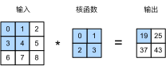

# 图像卷积
:label:`sec_conv_layer`

上节我们了解了卷积层的理论原理，现在我们看看它在实际中是如何应用的。由于卷积神经网络是探索图像数据结构的结晶，本节我们将以图像为例。


## 互相关运算

严格地说，卷积层所表达的运算可以被更准确地描述为*互相关运算*。
基于:numref:`sec_why-conv`中卷积层的描述，在这样一个层中，输入张量和核张量通过互相关运算产生输出张量。

让我们暂时忽略三维通道，看看如何处理二维数据和隐藏表示。在:numref:`fig_correlation`中，输入是高度为$3$、宽度为$3$的二维张量（即$3 \times 3$）。内核的高度和宽度都是 $2$，而内核窗口（或卷积窗口）的形状由内核的高度和宽度决定（即$2 \times 2$）。


:label:`fig_correlation`

在二维互相关运算中，我们的卷积窗口从输入张量的左上角开始，从左到右和从上到下滑动。
当卷积窗口滑动到新一个位置时，包含在该窗口中的输入子传感器与核张量进行元素相乘，得到的张量相加得到一个单一的标量值。
由此我们得出了这一位置的输出张量值。在如上例子中，输出张量的高度为2，宽度为2，如下四个元素由二维互相关运算导出：

$$
0\times0+1\times1+3\times2+4\times3=19,\\
1\times0+2\times1+4\times2+5\times3=25,\\
3\times0+4\times1+6\times2+7\times3=37,\\
4\times0+5\times1+7\times2+8\times3=43.
$$

请注意，输出大小略小于输入大小。这是因为卷积核的宽度和高度大于1，
而卷积核只与图像中每个大小完全适合的位置进行互相关运算。
所以，输出大小等于输入大小$n_h \times n_w$减去卷积核$k_h \times k_w$的大小再加$1$，即：

$$(n_h-k_h+1) \times (n_w-k_w+1).$$

接下来，我们在`corr2d`函数中实现如上过程，该函数接受输入张量`X`和内核张量`K`，并返回输出张量`Y`。

```{.python .input}
from d2l import mxnet as d2l
from mxnet import autograd, np, npx
from mxnet.gluon import nn
npx.set_np()
```

```{.python .input}
#@tab pytorch
from d2l import torch as d2l
import torch
from torch import nn
```

```{.python .input}
#@tab mxnet, pytorch
def corr2d(X, K):  #@save
    """Compute 2D cross-correlation."""
    h, w = K.shape
    Y = d2l.zeros((X.shape[0] - h + 1, X.shape[1] - w + 1))
    for i in range(Y.shape[0]):
        for j in range(Y.shape[1]):
            Y[i, j] = d2l.reduce_sum((X[i: i + h, j: j + w] * K))
    return Y
```

```{.python .input}
#@tab tensorflow
from d2l import tensorflow as d2l
import tensorflow as tf

def corr2d(X, K):  #@save
    """Compute 2D cross-correlation."""
    h, w = K.shape
    Y = tf.Variable(tf.zeros((X.shape[0] - h + 1, X.shape[1] - w + 1)))
    for i in range(Y.shape[0]):
        for j in range(Y.shape[1]):
            Y[i, j].assign(tf.reduce_sum(
                X[i: i + h, j: j + w] * K))
    return Y
```

我们可以从:numref:`fig_correlation`构造输入张量`X`和核张量`K`来验证上述二维互相关运算实现的输出。

```{.python .input}
#@tab all
X = d2l.tensor([[0.0, 1.0, 2.0], [3.0, 4.0, 5.0], [6.0, 7.0, 8.0]])
K = d2l.tensor([[0.0, 1.0], [2.0, 3.0]])
corr2d(X, K)
```

## 卷积层

卷积层将输入和内核进行互相关运算，并添加标量偏差以产生输出。
所以，卷积层的两个参数是内核权重和标量偏差。
在训练卷积层模型时，我们通常随机初始化内核权重，就像我们随机初始化完全连接层一样。

现在，基于上面定义的`corr2d`函数为前向传播函数，我们实现一个二维卷积层。
在`__init__`构造函数中，我们以`weight`和`bias`作为模型的两个参数。

```{.python .input}
class Conv2D(nn.Block):
    def __init__(self, kernel_size, **kwargs):
        super().__init__(**kwargs)
        self.weight = self.params.get('weight', shape=kernel_size)
        self.bias = self.params.get('bias', shape=(1,))

    def forward(self, x):
        return corr2d(x, self.weight.data()) + self.bias.data()
```

```{.python .input}
#@tab pytorch
class Conv2D(nn.Module):
    def __init__(self, kernel_size):
        super().__init__()
        self.weight = nn.Parameter(torch.rand(kernel_size))
        self.bias = nn.Parameter(torch.zeros(1))

    def forward(self, x):
        return corr2d(x, self.weight) + self.bias
```

```{.python .input}
#@tab tensorflow
class Conv2D(tf.keras.layers.Layer):
    def __init__(self):
        super().__init__()

    def build(self, kernel_size):
        initializer = tf.random_normal_initializer()
        self.weight = self.add_weight(name='w', shape=kernel_size,
                                      initializer=initializer)
        self.bias = self.add_weight(name='b', shape=(1, ),
                                    initializer=initializer)

    def call(self, inputs):
        return corr2d(inputs, self.weight) + self.bias
```

我们将如上`kernel_size`为$h \times w$卷积核的卷积层称为$h \times w$卷积层，其的高度和宽度分别为$h$和$w$。


## 图像中目标的边缘检测

如下是卷积层的一个简单应用：通过找到像素变化的位置来检测图像中不同颜色的边缘。首先，我们构造一个$6\times 8$像素的“图像”。中间四列为黑色（0），其余为白色（1）。

```{.python .input}
#@tab mxnet, pytorch
X = d2l.ones((6, 8))
X[:, 2:6] = 0
X
```

```{.python .input}
#@tab tensorflow
X = tf.Variable(tf.ones((6, 8)))
X[:, 2:6].assign(tf.zeros(X[:, 2:6].shape))
X
```

接下来，我们构造一个高度为1、宽度为2的内核`K`。当进行互相关运算时，如果水平相邻的两元素相同，则输出为零，否则输出为非零。

```{.python .input}
#@tab all
K = d2l.tensor([[1.0, -1.0]])
```

现在，我们对参数`X`（输入）和`K`（内核）执行互相关运算。如下所示，输出`Y`显示$1$代表从白色到黑色的边缘，$-1$代表从黑色到白色的边缘，其他所有输出为$0$。

```{.python .input}
#@tab all
Y = corr2d(X, K)
Y
```

现在我们将输入二维图像转置，进行如上的互相关运算。
不出所料，之前检测到的垂直边缘消失了。
所以，这个内核`K`只可以检测垂直边缘。

```{.python .input}
#@tab all
corr2d(d2l.transpose(X), K)
```

## 学习内核

如果我们知道这正是我们正在寻找的，那么用有限差分`[1, -1]`设计边缘检测器是一件很好的事情。然而，当我们观察更大的内核，并考虑连续的卷积层时，可能不可能精确地指定每个过滤器应该手动执行的操作。

现在让我们看看是否可以通过只查看输入-输出对来学习从`X`生成`Y`的内核。我们首先构造一个卷积层，并将其核初始化为随机张量。接下来，在每次迭代中，我们将使用平方误差来比较`Y`与卷积层的输出。然后我们可以计算梯度来更新内核。为了简单起见，下面我们对二维卷积层使用内置类，并忽略偏差。

```{.python .input}
# Construct a two-dimensional convolutional layer with 1 output channel and a
# kernel of shape (1, 2). For the sake of simplicity, we ignore the bias here
conv2d = nn.Conv2D(1, kernel_size=(1, 2), use_bias=False)
conv2d.initialize()

# The two-dimensional convolutional layer uses four-dimensional input and
# output in the format of (example, channel, height, width), where the batch
# size (number of examples in the batch) and the number of channels are both 1
X = X.reshape(1, 1, 6, 8)
Y = Y.reshape(1, 1, 6, 7)

for i in range(10):
    with autograd.record():
        Y_hat = conv2d(X)
        l = (Y_hat - Y) ** 2
    l.backward()
    # Update the kernel
    conv2d.weight.data()[:] -= 3e-2 * conv2d.weight.grad()
    if (i + 1) % 2 == 0:
        print(f'batch {i+1}, loss {float(l.sum()):.3f}')
```

```{.python .input}
#@tab pytorch
# Construct a two-dimensional convolutional layer with 1 output channel and a
# kernel of shape (1, 2). For the sake of simplicity, we ignore the bias here
conv2d = nn.Conv2d(1,1, kernel_size=(1, 2), bias=False)

# The two-dimensional convolutional layer uses four-dimensional input and
# output in the format of (example channel, height, width), where the batch
# size (number of examples in the batch) and the number of channels are both 1
X = X.reshape((1, 1, 6, 8))
Y = Y.reshape((1, 1, 6, 7))

for i in range(10):
    Y_hat = conv2d(X)
    l = (Y_hat - Y) ** 2
    conv2d.zero_grad()
    l.sum().backward()
    # Update the kernel
    conv2d.weight.data[:] -= 3e-2 * conv2d.weight.grad
    if (i + 1) % 2 == 0:
        print(f'batch {i+1}, loss {l.sum():.3f}')
```

```{.python .input}
#@tab tensorflow
# Construct a two-dimensional convolutional layer with 1 output channel and a
# kernel of shape (1, 2). For the sake of simplicity, we ignore the bias here
conv2d = tf.keras.layers.Conv2D(1, (1, 2), use_bias=False)

# The two-dimensional convolutional layer uses four-dimensional input and
# output in the format of (example channel, height, width), where the batch
# size (number of examples in the batch) and the number of channels are both 1
X = tf.reshape(X, (1, 6, 8, 1))
Y = tf.reshape(Y, (1, 6, 7, 1))

Y_hat = conv2d(X)
for i in range(10):
    with tf.GradientTape(watch_accessed_variables=False) as g:
        g.watch(conv2d.weights[0])
        Y_hat = conv2d(X)
        l = (abs(Y_hat - Y)) ** 2
        # Update the kernel
        update = tf.multiply(3e-2, g.gradient(l, conv2d.weights[0]))
        weights = conv2d.get_weights()
        weights[0] = conv2d.weights[0] - update
        conv2d.set_weights(weights)
        if (i + 1) % 2 == 0:
            print(f'batch {i+1}, loss {tf.reduce_sum(l):.3f}')
```

请注意，在10次迭代之后，错误已经降到一个小值。现在我们来看看我们所学的核张量。

```{.python .input}
d2l.reshape(conv2d.weight.data(), (1, 2))
```

```{.python .input}
#@tab pytorch
d2l.reshape(conv2d.weight.data, (1, 2))
```

```{.python .input}
#@tab tensorflow
d2l.reshape(conv2d.get_weights()[0], (1, 2))
```

实际上，学习到的核张量非常接近我们之前定义的核张量`K`。

## 互相关和卷积

回想一下我们在:numref:`sec_why-conv`中观察到的互相关和卷积运算之间的对应关系。这里让我们继续考虑二维卷积层。如果这样的层执行:eqref:`eq_2d-conv-discrete`中定义的严格卷积运算，而不是互相关怎么办？为了得到严格*卷积*运算的输出，我们只需要水平和垂直翻转二维核张量，然后用输入张量执行*互相关*运算。

值得注意的是，由于核是在深度学习中从数据中学习的，因此无论这些层执行严格的卷积运算还是互相关运算，卷积层的输出都不会受到影响。

为了说明这一点，假设卷积层执行*互相关*并学习:numref:`fig_correlation`中的内核，该内核在这里表示为矩阵$\mathbf{K}$。假设其他条件不变，当这个层执行严格的*卷积*时，学习的内核$\mathbf{K}'$在水平和垂直翻转$\mathbf{K}'$之后将与$\mathbf{K}$相同。也就是说，当卷积层对:numref:`fig_correlation`和$\mathbf{K}'$中的输入执行严格*卷积*时，将获得:numref:`fig_correlation`中相同的输出（输入与$\mathbf{K}$的互相关）。

为了与深度学习文献中的标准术语保持一致，我们将继续将互相关操作称为卷积，尽管严格地说，它略有不同。此外，我们使用术语*元素*来表示表示层表示或卷积核的任何张量的入口（或组件）。

## 特征图和感受野

如在:numref:`subsec_why-conv-channels`中所述，:numref:`fig_correlation`中输出的卷积层有时被称为*特征映射*，因为它可以被视为到下一层的空间维度（例如，宽度和高度）中的学习表示（特征）。在CNNs中，对于某一层的任何元素$x$，其*接收场*是指在前向传播期间可能影响$x$计算的所有元素（来自所有先前层）。注意，接收野可能大于输入的实际大小。

让我们继续用:numref:`fig_correlation`来解释感受野。给定$2 \times 2$卷积核，阴影输出元素（值$19$）的接收域是输入阴影部分的四个元素。现在让我们将$2 \times 2$的输出表示为$\mathbf{Y}$，并考虑一个更深的CNN，该CNN具有附加的$\mathbf{Y}$卷积层，该卷积层以$\mathbf{Y}$为输入，输出单个元素$z$。在这种情况下，$\mathbf{Y}$上的$z$的接收字段包括$\mathbf{Y}$的所有四个元素，而输入上的接收字段包括所有九个输入元素。因此，当一个特征图中的任何元素需要一个更大的接受野来检测更广区域的输入特征时，我们可以构建一个更深的网络。

## 摘要

* 二维卷积层的核心计算是二维互相关运算。最简单的形式是，对二维输入数据和内核执行互相关操作，然后添加一个偏差。
* 我们可以设计一个核来检测图像的边缘。
* 我们可以从数据中学习内核的参数。
* 通过从数据中学习核，卷积层的输出不受影响，而不管这些层执行了什么操作（严格卷积或互相关）。
* 当特征图中的任何元素需要一个更大的接受域来检测输入的更广泛的特征时，可以考虑更深的网络。

## 练习

1. 构建一个具有对角线边缘的图像`X`。
    1. 如果将本节中的内核`K`应用于它，会发生什么情况？
    1. 如果你转置`X`怎么办？
    1. 如果你转置`K`怎么办？
1. 当您尝试自动找到我们创建的`Conv2D`类的渐变时，您看到了什么样的错误消息？
1. 如何通过改变输入张量和核张量来将互相关运算表示为矩阵乘法？
1. 手工设计一些内核。
    1. 二阶导数的核形式是什么？
    1. 积分的核心是什么？
    1. 得到$d$次导数的最小核大小是多少？

:begin_tab:`mxnet`
[Discussions](https://discuss.d2l.ai/t/65)
:end_tab:

:begin_tab:`pytorch`
[Discussions](https://discuss.d2l.ai/t/66)
:end_tab:

:begin_tab:`tensorflow`
[Discussions](https://discuss.d2l.ai/t/271)
:end_tab:
