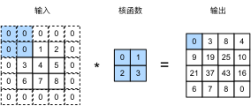

# 填充和步幅
:label:`sec_padding`

在前面的 :numref:`fig_correlation` 示例中，我们的输入的高度和宽度都是 3，卷积内核的高度和宽度都是 2，从而产生了维度为 $2\times2$ 的输出表示形式。正如我们在 :numref:`sec_conv_layer` 中广义的那样，假设输入形状为 $n_h\times n_w$，卷积核形状为 $k_h\times k_w$，则输出形状为 $(n_h-k_h+1) \times (n_w-k_w+1)$。因此，卷积图层的输出形状由输入的形状和卷积内核的形状决定。

在几种情况下，我们采用了影响输出大小的技术，包括填充和带状卷积。作为动机，请注意，由于内核的宽度和高度通常大于 $1$，在应用许多连续卷积后，我们倾向于使用比输入小得多的输出。如果我们从 $240 \times 240$ 像素图像开始，$10$ 层的卷积将图像减少到 $200 \times 200$ 像素，切掉图像的 $30\ %$，并与它消除了原始图像边界上的任何有趣的信息。
*填充 * 是处理此问题的最流行工具。

在其他情况下，我们可能希望大幅度降低维度，例如，如果我们发现原始输入分辨率很难操作。
*带状卷积 * 是一种流行的技术，可以在这些情况下提供帮助。

## 填充

如上所述，应用卷积图层时的一个棘手问题是，我们倾向于在图像周边丢失像素。由于我们通常使用小内核，因此对于任何给定的卷积，我们可能只会丢失几个像素，但随着我们应用许多连续卷积图层，这可能会加起来。这个问题的一个简单的解决方案是在输入图像的边界周围添加额外的填充像素，从而增加图像的有效大小。通常，我们将额外像素的值设置为零。在 :numref:`img_conv_pad` 中，我们填充了一个 $3 \times 3$ 输入，将其大小增加到 $5 \times 5$。相应的输出随后增加为 $4 \times 4$ 矩阵。阴影部分是第一个输出元素以及用于输出计算的输入和核张量元素：$0\times0+0\times1+0\times2+0\times3=0$。


:label:`img_conv_pad`

一般来说，如果我们总共添加 $p_h$ 行填充（大约一半在顶部，一半在底部）和总共 $p_w$ 列填充（大约一半在左边，一半在右边），则输出形状将为

$$(n_h-k_h+p_h+1)\times(n_w-k_w+p_w+1).$$

这意味着输出的高度和宽度将分别增加 $p_h$ 和 $p_w$。

在很多情况下，我们希望设置 $p_h=k_h-1$ 和 $p_w=k_w-1$ 来给输入和输出相同的高度和宽度。这样就可以在构建网络时更轻松地预测每个图层的输出形状。假设 $k_h$ 在这里是奇数，我们将在高度的两侧填充 $p_h/2$ 行。如果 $k_h$ 是偶数的，一种可能性是在输入的顶部填充 $\lceil p_h/2\rceil$ 行，在底部填充 $\lfloor p_h/2\rfloor$ 行。我们将以相同的方式填充宽度的两侧。

CNN 通常使用具有奇数高度和宽度值（如 1、3、5 或 7）的卷积内核。选择奇数内核大小的好处是，我们可以保留空间维度，同时在顶部和底部使用相同数量的行进行填充，在左侧和右侧使用相同数量的列进行填充。

此外，这种使用奇数内核和填充精确保持维度的做法提供了文书上的好处。对于任何二维张量 `X`，当内核的大小为奇数，所有边的填充行和列数相同，产生与输入高度和宽度相同的输出时，我们知道输出 `Y[i, j]` 是通过输入和卷积内核的交叉相关计算的，窗口以 `X[i, j]` 为中心。

在下面的示例中，我们创建一个高度和宽度为 3 的二维卷积图层，并在所有侧面应用 1 个像素的填充。给定高度和宽度为 8 的输入，我们发现输出的高度和宽度也为 8。

```{.python .input}
from mxnet import np, npx
from mxnet.gluon import nn
npx.set_np()

# For convenience, we define a function to calculate the convolutional layer.
# This function initializes the convolutional layer weights and performs
# corresponding dimensionality elevations and reductions on the input and
# output
def comp_conv2d(conv2d, X):
    conv2d.initialize()
    # Here (1, 1) indicates that the batch size and the number of channels
    # are both 1
    X = X.reshape((1, 1) + X.shape)
    Y = conv2d(X)
    # Exclude the first two dimensions that do not interest us: examples and
    # channels
    return Y.reshape(Y.shape[2:])

# Note that here 1 row or column is padded on either side, so a total of 2
# rows or columns are added
conv2d = nn.Conv2D(1, kernel_size=3, padding=1)
X = np.random.uniform(size=(8, 8))
comp_conv2d(conv2d, X).shape
```

```{.python .input}
#@tab pytorch
import torch
from torch import nn

# We define a convenience function to calculate the convolutional layer. This
# function initializes the convolutional layer weights and performs
# corresponding dimensionality elevations and reductions on the input and
# output
def comp_conv2d(conv2d, X):
    # Here (1, 1) indicates that the batch size and the number of channels
    # are both 1
    X = X.reshape((1, 1) + X.shape)
    Y = conv2d(X)
    # Exclude the first two dimensions that do not interest us: examples and
    # channels
    return Y.reshape(Y.shape[2:])
# Note that here 1 row or column is padded on either side, so a total of 2
# rows or columns are added
conv2d = nn.Conv2d(1, 1, kernel_size=3, padding=1)
X = torch.rand(size=(8, 8))
comp_conv2d(conv2d, X).shape
```

```{.python .input}
#@tab tensorflow
import tensorflow as tf

# We define a convenience function to calculate the convolutional layer. This
# function initializes the convolutional layer weights and performs
# corresponding dimensionality elevations and reductions on the input and
# output
def comp_conv2d(conv2d, X):
    # Here (1, 1) indicates that the batch size and the number of channels
    # are both 1
    X = tf.reshape(X, (1, ) + X.shape + (1, ))
    Y = conv2d(X)
    # Exclude the first two dimensions that do not interest us: examples and
    # channels
    return tf.reshape(Y, Y.shape[1:3])
# Note that here 1 row or column is padded on either side, so a total of 2
# rows or columns are added
conv2d = tf.keras.layers.Conv2D(1, kernel_size=3, padding='same')
X = tf.random.uniform(shape=(8, 8))
comp_conv2d(conv2d, X).shape
```

当卷积内核的高度和宽度不同时，我们可以通过为高度和宽度设置不同的填充数字来使输出和输入具有相同的高度和宽度。

```{.python .input}
# Here, we use a convolution kernel with a height of 5 and a width of 3. The
# padding numbers on either side of the height and width are 2 and 1,
# respectively
conv2d = nn.Conv2D(1, kernel_size=(5, 3), padding=(2, 1))
comp_conv2d(conv2d, X).shape
```

```{.python .input}
#@tab pytorch
# Here, we use a convolution kernel with a height of 5 and a width of 3. The
# padding numbers on either side of the height and width are 2 and 1,
# respectively
conv2d = nn.Conv2d(1, 1, kernel_size=(5, 3), padding=(2, 1))
comp_conv2d(conv2d, X).shape
```

```{.python .input}
#@tab tensorflow
# Here, we use a convolution kernel with a height of 5 and a width of 3. The
# padding numbers on either side of the height and width are 2 and 1,
# respectively
conv2d = tf.keras.layers.Conv2D(1, kernel_size=(5, 3), padding='valid')
comp_conv2d(conv2d, X).shape
```

## 步伐

计算互相关时，我们从输入张量左上角的卷积窗口开始，然后向下和向右滑动所有位置。在前面的示例中，我们默认一次滑动一个元素。但是，有时，无论是为了提高计算效率，还是因为我们希望缩减采样，我们一次移动窗口多个元素，跳过中间位置。

我们将每张幻灯片遍历的行数和列数称为 * 步长 *。到目前为止，我们已经使用了 1 的步幅，无论是高度还是宽度。有时，我们可能需要使用更大的步幅。:numref:`img_conv_stride` 显示了一个二维互相关运算，垂直步幅为 3，水平步幅为 2。阴影部分是输出元素以及用于输出计算的输入和核张量元素：$0\times0+0\times1+1\times2+2\times3=8$，$0\times0+6\times1+0\times2+0\times3=6$。我们可以看到，当输出第一列的第二个元素时，卷积窗口向下滑动三行。当输出第一行的第二个元素时，卷积窗口会向右滑动两列。当卷积窗口继续向输入的右侧滑动两列时，没有输出，因为输入元素无法填充窗口（除非我们添加另一列填充）。


:label:`img_conv_stride`

通常，当高度的步幅为 $s_h$，宽度的步幅为 $s_w$ 时，输出形状为

$$\lfloor(n_h-k_h+p_h+s_h)/s_h\rfloor \times \lfloor(n_w-k_w+p_w+s_w)/s_w\rfloor.$$

如果我们设置了 $p_h=k_h-1$ 和 $p_w=k_w-1$，那么输出形状将被简化为 $\lfloor(n_h+s_h-1)/s_h\rfloor \times \lfloor(n_w+s_w-1)/s_w\rfloor$。更进一步，如果输入的高度和宽度可以被高度和宽度上的步幅整除，则输出形状将为 $(n_h/s_h) \times (n_w/s_w)$。

下面，我们将高度和宽度的步幅设置为 2，从而将输入的高度和宽度减半。

```{.python .input}
conv2d = nn.Conv2D(1, kernel_size=3, padding=1, strides=2)
comp_conv2d(conv2d, X).shape
```

```{.python .input}
#@tab pytorch
conv2d = nn.Conv2d(1, 1, kernel_size=3, padding=1, stride=2)
comp_conv2d(conv2d, X).shape
```

```{.python .input}
#@tab tensorflow
conv2d = tf.keras.layers.Conv2D(1, kernel_size=3, padding='same', strides=2)
comp_conv2d(conv2d, X).shape
```

接下来，我们将看一个稍微复杂的例子。

```{.python .input}
conv2d = nn.Conv2D(1, kernel_size=(3, 5), padding=(0, 1), strides=(3, 4))
comp_conv2d(conv2d, X).shape
```

```{.python .input}
#@tab pytorch
conv2d = nn.Conv2d(1, 1, kernel_size=(3, 5), padding=(0, 1), stride=(3, 4))
comp_conv2d(conv2d, X).shape
```

```{.python .input}
#@tab tensorflow
conv2d = tf.keras.layers.Conv2D(1, kernel_size=(3,5), padding='valid', strides=(3, 4))
comp_conv2d(conv2d, X).shape
```

为了简洁起见，当输入高度和宽度两侧的填充数字分别为 $p_h$ 和 $p_w$ 时，我们称之为填充 $(p_h, p_w)$。具体来说，当 $p_h = p_w = p$ 时，填充是 $p$。当高度和宽度的步幅分别是 $s_h$ 和 $s_w$ 时，我们称之为步幅 $(s_h, s_w)$。具体来说，当 $s_h = s_w = s$ 时，步幅为 $s$。默认情况下，填充为 0，步幅为 1。在实践中，我们很少使用不均匀的步幅或填充，也就是说，我们通常有 $p_h = p_w$ 和 $s_h = s_w$。

## 摘要

* 填充可以增加输出的高度和宽度。这通常用于为输出提供与输入相同的高度和宽度。
* 步幅可以降低输出的分辨率，例如将输出的高度和宽度降低到输入的高度和宽度的 $1/n$（$n$ 是一个大于 $1$ 的整数）。
* 填充和步幅可用于有效调整数据的维度。

## 练习

1. 对于本节的最后一个示例，使用数学计算输出形状，以查看它是否与实验结果一致。
1. 在本节中的实验中尝试其他填充和步幅组合。
1. 对于音频信号，步长 2 是什么对应的？
1. 大于 1 的步幅有什么计算优势？

:begin_tab:`mxnet`
[Discussions](https://discuss.d2l.ai/t/67)
:end_tab:

:begin_tab:`pytorch`
[Discussions](https://discuss.d2l.ai/t/68)
:end_tab:

:begin_tab:`tensorflow`
[Discussions](https://discuss.d2l.ai/t/272)
:end_tab:
