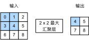

# 池化层

回忆在[“卷积层”](./conv-layer.md)小节里介绍的图片物体边缘检测应用中，我们构造了卷积核来精确的找到像素变化的位置。例如如果输出`Y[i, j]=1`，那么表示`X[i, j]`和`X[i, j+1]`数值不一样，这可能意味着物体边缘通过这两个元素之间。但实际中图片里我们感兴趣的物体不会总出现在固定位置，即使我们连续拍摄同一个物体也极有可能出现像素上的偏移。这样导致同一个边缘对应的输出可能出现在`Y`中不同位置，进而对后面的模式识别造成不便。

这一节我们介绍池化层（pooling layer），它的提出是为了缓解卷积层对位置的过度敏感性。

## 二维最大、平均池化层

池化层同卷积层一样每次对输入数据的一个固定形状窗口元素计算输出。不同于卷积层里计算输入和核相关性，池化层直接计算窗口内元素的最大值或者平均值。图5.6展示了$2\times 2$最大池化层，其输出的第一个元素是输入的左上$2\times 2$窗口里的四个元素的最大值。然后同卷积层一样依次向左或向下移动窗口来计算其余的输出。



如果这个池化层的输入是来自于前面我们构造了卷积核的卷积层的输出。假设此卷积层输入是`X`，那么不管是`X[i, j]`和`X[i, j+1]`值不同，还是`X[i, j+1]`和`X[i, j+2]`不同，池化层输出均有`Y[i, j]=1`。换句话说，使用$2\times 2$最大池化层，只要卷积层识别的模式在高和宽上移动不超过一个元素，我们均可以将其检测出来。

池化层的前向计算实现在`pool2d`函数里。它跟[“卷积层”](conv-layer.md)一节里`corr2d`函数非常类似，唯一的区别是在计算`Y[h, w]`上。

```{.python .input  n=11}
from mxnet import nd
from mxnet.gluon import nn

def pool2d(X, pool_size, mode='max'):
    p_h, p_w = pool_size
    Y = nd.zeros((X.shape[0] - p_h + 1, X.shape[1] - p_w + 1))
    for i in range(Y.shape[0]):
        for j in range(Y.shape[1]):
            if mode == 'max':
                Y[i, j] = X[i: i + p_h, j: j + p_w].max()
            elif mode == 'avg':
                Y[i, j] = X[i: i + p_h, j: j + p_w].mean()            
    return Y
```

构造图5.6中的数据来验证实现的正确性。

```{.python .input  n=13}
X = nd.array([[0, 1, 2], [3, 4, 5], [6, 7, 8]])
pool2d(X, (2, 2))
```

同时我们试一试平均池化层。

```{.python .input  n=14}
pool2d(X, (2, 2), 'avg')
```

## 填充和步幅

同卷积层一样，池化层也可以填充输入高宽两侧的数据和调整窗口的移动步幅来改变输入大小。我们将通过`nn`模块里的二维最大池化层MaxPool2D来演示它的工作机制。我们先构造一个`(1, 1, 4, 4)`形状的输入数据，前两个维度分别是批量和通道。

```{.python .input  n=15}
X = nd.arange(16).reshape((1, 1, 4, 4))
X
```

MaxPool2D类里默认步幅设置成跟池化窗大小一样。下面使用`(3, 3)`窗口，默认获得`(3, 3)`步幅。

```{.python .input  n=16}
pool2d = nn.MaxPool2D(3)
# 因为池化层没有模型参数，所以不需要调用参数初始化函数。
pool2d(X)
```

我们可以手动指定步幅和填充。

```{.python .input  n=7}
pool2d = nn.MaxPool2D(3, padding=1, strides=2)
pool2d(X)
```

当然，我们也可以是非方形的窗口，并且指定各个方向上的填充和步幅。

```{.python .input  n=8}
pool2d = nn.MaxPool2D((2, 3), padding=(1, 2), strides=(2, 3))
pool2d(X)
```

## 多通道

在处理多通道输入数据时，池化层对每个输入通道分别池化，而不是像卷积层那样混合输入通道。这个意味着池化层的输出通道跟输入通道数相同。下面我们将`X`和`X+1`在通道维度上合并来构造通道数为2输入。

```{.python .input  n=9}
X = nd.concat(X, X + 1, dim=1)
X
```

做池化后我们发现输出通道仍然是2，而且通道0的结果跟之前一致。

```{.python .input  n=10}
pool2d = nn.MaxPool2D(3, padding=1, strides=2)
pool2d(X)
```

## 小结

- 池化层通过滑动窗口计算结果，其通常直接取输入窗口内元素的最大值或者平均值作为输出。
- 池化层的一个主要作用是缓解卷积层对位置的敏感性。

## 练习

- 分析池化层的计算复杂度。假设输入大小为$c\times h\times w$，我们使用$p_h\times p_w$的池化窗，而且使用$(p_h, p_w)$填充和$(s_h, s_w)$步幅，那么这个池化层的前向计算需要多少操作？
- 想一想最大池化层和平均池化层的区别主要在哪里？
- 你觉得最小池化层这个想法怎么样？

## 扫码直达[讨论区](https://discuss.gluon.ai/t/topic/6406)


