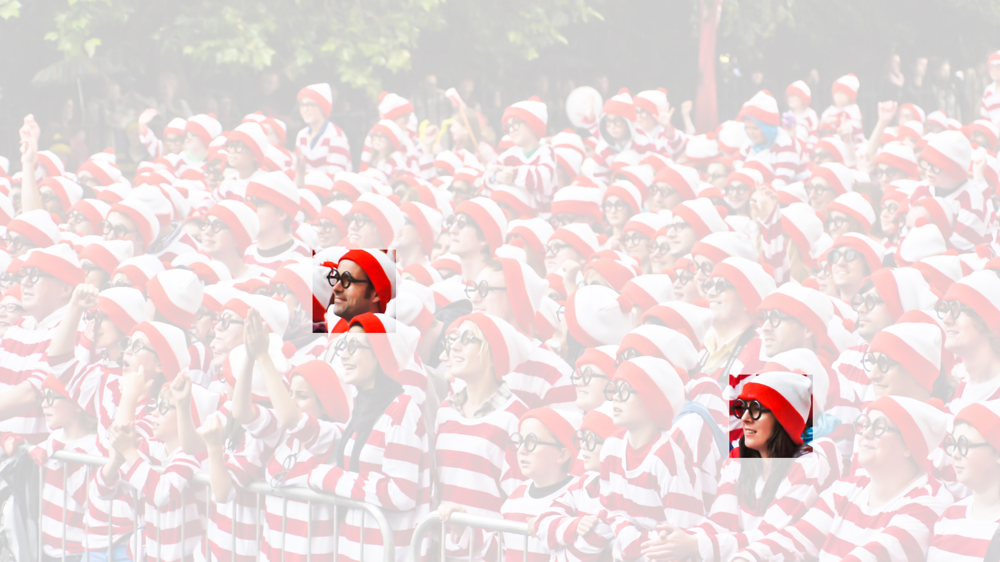

# 从完全连接的层到卷积
:label:`sec_why-conv`

我们之前讨论的MLP模型十分适用处理表格数据。这些表格数据，每行分别对应每个样本，每列分别对应每个特征。这些特征可能相互影响，但我们并没有假设这些特征如何交互。然而，对于高维感知数据，这种MLP单一结构模型可能会变得笨拙。

例如，在之前区分猫和狗的例子中，假设我们收集了一个照片数据集，每张照片具有百万级像素，这意味着MLP的每个输入都有一百万个维度。然而即使MLP只有1000个隐藏层，这个神经网络将有$10^6 \times 10^3 = 10^9$个参数。除非我们有大量的GPU，分布式优化训练的经验以及超乎常人的耐心，否则很难学习这个网络。

细心的读者可能会反对这一论点，认为要求百万像素分辨率过分吹毛求疵。
然而，如果减小为十万像素，1000隐藏单元的隐藏层可能不足以学习到良好的图像特征，所以我们仍然需要数十亿个参数。
此外，拟合不胜枚举的参数还需要收集大量的数据，然而人类视觉和传统机器学习模型都能在小数据集上很好地区分猫和狗，这启发我们去深度挖掘图像中可以被人类和机器学习模型捕捉的丰富的二维结构。
而卷积神经网络（convolutional neural networks，CNN）就是利用二维结构处理图像，是一种创造性的神经网络。

## 不变性

想象一下，在一个对象检测任务中，我们不应过分在意图像中物体的确切位置，比如猪通常不在天上飞，飞机通常不游泳。
我们可以从儿童游戏 ”沃尔多在哪里”（:numref:`img_waldo`）中汲取一些灵感。
这个游戏包括一些混乱的场景，游戏玩家的目标是找到沃尔多,而沃尔多通常潜伏在一些不太可能的位置。
所以尽管沃尔多的很有特点，在眼花缭乱的场景中找到他也如大海捞针。

由于沃尔多潜藏的地方并不取决于它出现的位置，我们可以使用一个“沃尔多检测器”扫描图像，该检测器将图像分成数个小贴片，并为每个贴片包含沃尔多的可能性打分。而CNN系统化了这个“空间不变性”的概念，用较少参数来学习有用的特征。

:width:`400px`
:label:`img_waldo`

现在，我们将如上推断系统化，来设计一下适用于计算机视觉的神经网络体系结构：

1. 平移不变性：神经网络的前部层应该对相同的图像区域做出类似的响应，不管它出现在图像中的哪个位置。这个原理即为“平移不变性”。
1. 局部性：神经网络的前部层应该只探索输入图像中的局部区域，而不考虑遥远区域的图像内容，这就是“局部性”原则。最终，这些局部特征可以融会贯通，在整个图像级别上做出预测。

让我们看看这是如何转化为数学的。

## 限制MLP

首先，假设以二维图像$\mathbf{X}$作为输入，那么我们MLP的隐藏表示$\mathbf{H}$在数学上是一个矩阵，在代码中则是一个二维张量。
由于$\mathbf{X}$和$\mathbf{H}$具有相同的二维形状，我们可以得出如下结论：输入$\mathbf{X}$和隐藏表示$\mathbf{H}$都具有空间结构。由此，我们用$[\mathbf{X}]{i, j}$和$[\mathbf{H}]{i, j}$分别表示输入图像和隐藏表示中的（$i$, $j$）元素。

为了使每个输入像素都有神经元处理，我们将参数从权重矩阵替换为四阶权重张量$\mathsf{W}$,如同我们先前在MLP中所做的那样。假设$\mathbf{U}$为偏差参数，我们可以将全连通层表示为

$$\begin{aligned} \left[\mathbf{H}\right]{i, j} &= [\mathbf{U}]{i, j} + \sum_k \sum_l[\mathsf{W}]{i, j, k, l} [\mathbf{X}]{k, l}\ &= [\mathbf{U}]{i, j} + \sum_a \sum_b [\mathsf{V}]{i, j, a, b} [\mathbf{X}]_{i+a, j+b}.\end{aligned}$$

其中，从$\mathsf{W}$到$\mathsf{V}$的转换只是形式的转换，因为在两个四阶张量中，系数之间存在一对一的对应关系。
我们只需重新索引下标$(k, l)$，使$k = i+a$、$l = j+b$， 由此$[\mathsf{V}]{i, j, a, b} = [\mathsf{W}]{i, j, i+a, j+b}$。
这里的索引$a$和$b$覆盖了正偏移和负偏移，覆盖了整个图像。
综上所述，对于隐藏表示$[\mathbf{H}]{i, j}$中的任何给定位置（$i$, $j$），我们通过对$x$中以$(i, j)$为中心并按$[\mathsf{V}]{i, j, a, b}$权重的像素求和来计算其值。

### 平移不变性

现在让我们引用上面的第一个原则：平移不变性。这意味着输入$\mathbf{X}$中的移位应该仅与隐藏表示$\mathbf{H}$中的移位有关， 所以$\mathsf{V}$和$\mathbf{U}$的权重实际上不依赖于$(i, j)$的值。也就是说，$[\mathsf{V}]{i, j, a, b} = [\mathbf{V}]{a, b}$，并且$\mathbf{U}$是一个常数，比如$u$。因此，我们可以简化$\mathbf{H}$定义为：

$$[\mathbf{H}]{i, j} = u + \sum_a\sum_b [\mathbf{V}]{a, b} [\mathbf{X}]_{i+a, j+b}.$$

这就是卷积！我们使用系数$(i+a, j+b)$有效地加权位置$(i, j)$附近的像素以获得隐藏表示$[\mathbf{H}]{i, j}$。注意，$[\mathbf{V}]{a, b}$的参数比$[\mathsf{V}]_{i, j, a, b}$少很多，因为前者不再依赖于图像中的位置。太棒了，我们已经通过平移不变性取得了重大进展！

### 局部性

现在引用上述的第二个原则：局部性。如上所述，为了收集用来训练$[\mathbf{H}]{i, j}$参数的相关信息，我们不应偏离到距$(i, j)$很远的地方。这意味着在$|a|> \Delta$或$|b| > \Delta$的范围之外，我们可以假定$[\mathbf{V}]{a, b} = 0$。由此，我们可以将$[\mathbf{H}]_{i, j}$重写为

$$[\mathbf{H}]{i, j} = u + \sum{a = -\Delta}^{\Delta} \sum_{b = -\Delta}^{\Delta} [\mathbf{V}]{a, b} [\mathbf{X}]{i+a, j+b}.$$ :eqlabel:eq_conv-layer

简而言之，:eqref:eq_conv-layer是一个卷积层，而卷积神经网络是包含卷积层的一类特殊的神经网络。
在深度学习科研中，$\mathbf{V}$被称为卷积核或者过滤器，是可学习的权重。
当图像处理的局部区域很小时，卷积神经网络CNN与完全连接的网络MLP的训练差异可能是巨大的：以前，MLP可能需要数十亿个参数来表示，而现在CNN通常只需要几百个参数，而且不X需要改变输入或隐藏表示的维数。
以上所有的权重学习都依赖于归纳偏差，当这种偏差与实际情况相符时，我们就可以得到有效的模型，这些模型能很好地推广到不可见的数据中。
但如果这些假设与实际情况不符，比如当图像不是平移不变时，我们的模型可能难以学习数据。

## 卷积

在进一步讨论之前，我们先简要回顾一下为什么上面的操作被称为卷积。在数学中，两个函数（比如$f, g: \mathbb{R}^d \to \mathbb{R}$）之间的*卷积*被定义为

$$(f * g)(\mathbf{x}) = \int f(\mathbf{z}) g(\mathbf{x}-\mathbf{z}) d\mathbf{z}.$$

也就是说，卷积是测量$f$和$g$之间（把函数“翻转”并移位$\mathbf{x}$时）的重叠。
当我们有离散对象时（即定义域为$\mathbb{Z}$），积分就变成和，我们得到以下定义：

$$(f * g)(i) = \sum_a f(a) g(i-a).$$

对于二维张量，则为$f$在$(a, b)$和$g$在$(i-a, j-b)$上的对应和：

$$(f * g)(i, j) = \sum_a\sum_b f(a, b) g(i-a, j-b).$$
:eqlabel:`eq_2d-conv-discrete`

这看起来类似于 :eqref:`eq_conv-layer`，但有一个主要区别：这里不是使用 $(i+a, j+b)$，而是使用差异。然而，这种区别是可以化简的，因为我们总是可以匹配 :eqref:`eq_conv-layer` 和 :eqref:`eq_2d-conv-discrete` 之间的符号。我们在 :eqref:`eq_conv-layer` 中的原始定义更正确地描述了*互相关*。我们将在下一节中讨论这一问题。

## “沃尔多在哪里” 回顾

回到我们的 Waldo 探测器，让我们看看这是什么样子。卷积层根据滤波器 $\mathsf{V}$ 选取给定大小的窗口，并对强度进行称重，如 :numref:`fig_waldo_mask` 所示。我们可能旨在学习一个模型，以便在 “华尔顿” 最高的位置，我们应该在隐藏图层表示中找到一个峰值。

回到上面的沃尔多探测器，让我们看看它到底是什么样子。卷积层根据滤波器$\mathsf{V}$选取给定大小的窗口，并加权处理图片，如:numref:fig_waldo_mask中所示。我们的目标是学习一个模型，以便探测出在“沃尔多”最可能出现的地方。

:width:`400px`
:label:`fig_waldo_mask`

### 渠道
:label:`subsec_why-conv-channels`

然而这种方法只有一个问题。以上，我们忽略了图像的 3 原色组成：红色、绿色和蓝色。实际上，图像不是二维张量，而是三阶张量，其特征是高度、宽度和通道，例如形状为 $1024 \times 1024 \times 3$ 的像素。
虽然前两个轴涉及空间关系，但第三个轴可视为为每个像素位置分配多维制图表达。因此，我们的指数为 $\mathsf{X}$。卷积滤波器必须相应地适应。我们现在已经拥有了 $[\mathsf{V}]_{a,b,c}$，而不是 $[\mathbf{V}]_{a,b}$。

此外，正如我们的输入由三阶张量组成一样，最好将我们的隐藏表示类似于三阶张量 $\mathsf{H}$。换句话说，我们不仅需要对应于每个空间位置的单个隐藏制图表达，而是需要一个与每个空间位置相对应的整个隐藏制图表达矢量。我们可以认为隐藏的表示是由一些堆叠在彼此之上的二维网格组成的。与输入一样，这些通道有时称为 * 频道 *。它们有时也称为 * 要素地图 *，因为每个图层都为后续图层提供了一组空间化的学习要素。直观而言，您可能会想象在较接近输入的较低图层中，某些通道可能会专门识别边缘，而其他通道则可以识别纹理。

为了在输入 ($\mathsf{X}$) 和隐藏表示 ($\mathsf{H}$) 中支持多个通道，我们可以将第四个坐标添加到 $\mathsf{V}$：$[\mathsf{V}]_{a, b, c, d}$。把我们所拥有的一切放在一起：

$$[\mathsf{H}]_{i,j,d} = \sum_{a = -\Delta}^{\Delta} \sum_{b = -\Delta}^{\Delta} \sum_c [\mathsf{V}]_{a, b, c, d} [\mathsf{X}]_{i+a, j+b, c},$$
:eqlabel:`eq_conv-layer-channels`

其中 $d$ 在隐藏的表示中对输出通道进行索引。随后的卷积层将继续采用三阶张量 $\mathsf{H}$ 作为输入。更一般地说，:eqref:`eq_conv-layer-channels` 是多个通道的卷积层的定义，其中 $\mathsf{V}$ 是层的内核或滤波器。

我们仍然需要处理许多行动。例如，我们需要弄清楚如何将所有隐藏的表示组合到单个输出中，例如，图像中是否有 Waldo * 在任何位置。我们还需要决定如何高效地计算事物，如何组合多层、适当的激活函数，以及如何做出合理的设计选择，以便产生实际上有效的网络。我们将在本章其余部分讨论这些问题。

## 摘要

* 图像中的翻译不变性意味着将以相同的方式处理图像的所有补丁。
* 局部性意味着只使用一小部分像素邻域来计算相应的隐藏制图表达。
* 在图像处理中，卷积图层所需的参数通常比完全连接的图层少得多。
* CNN 是一个特殊的神经网络系列，其中包含卷积层。
* 输入和输出通道允许我们的模型在每个空间位置捕捉图像的多个方面。

## 练习

1. 假定卷积内核的大小为 $\Delta = 0$。表明在这种情况下，卷积内核为每组通道独立实现 MLP。
1. 为什么翻译不变性毕竟不是一个好主意？
1. 在决定如何处理与图像边界上像素位置相对应的隐藏表示时，我们必须处理哪些问题？
1. 描述音频的类似卷积层。
1. 您是否认为卷积图层也可能适用于文本数据？为什么还是为什么不呢？
1. 证明那是什么

[Discussions](https://discuss.d2l.ai/t/64)
