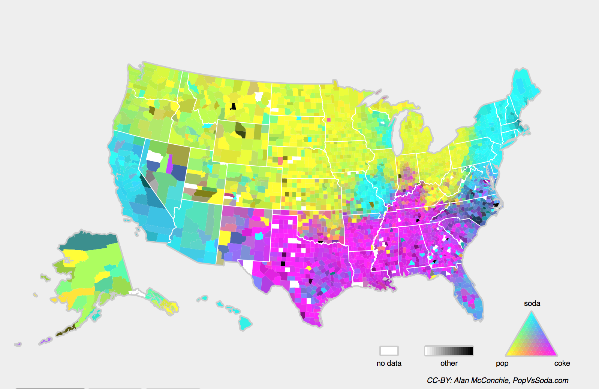

# 环境和分布迁移

在前面的部分中，我们通过了许多机器学习的实践应用程序，将模型适应各种数据集。然而，我们从未停止思考数据来自哪里，或者我们计划最终对模型的输出做什么。拥有数据的机器学习开发人员往往会急于开发模型，而不会暂停考虑这些基本问题。

许多失败的机器学习部署都可以追溯到这种模式。有时，模型看起来像测试集准确率测量的那样表现出色，但是当数据分布突然发生变化时，模型在部署过程中会出现灾难性失败。更隐蔽的是，有时模型的部署可能成为扰乱数据分布的催化剂。样本，我们训练了一个模型来预测谁将偿还与违约贷款，发现申请人选择的鞋类与违约风险有关（牛津表示还款，运动鞋表示默认）。此后，我们可能倾向于向所有穿牛津乐道的申请人提供贷款，并拒绝所有穿运动鞋的申请人。

在这种情况下，我们从模式承认到决策过程中考虑不周的飞跃以及我们未能批判性地考虑环境可能产生灾难性后果。对于初学者来说，一旦我们开始根据鞋类做出决策，客户就会赶上并改变他们的行为。不久之后，所有申请人都会穿着牛津乐道，信用信誉不会有任何改善。花一分钟时间来解决这个问题，因为在许多机器学习应用中都存在着类似的问题：通过向环境介绍我们基于模型的决策，我们可能会破坏这个模型。

虽然我们不可能在一个部分中对这些主题进行完整的处理，但我们的目标是揭示一些常见问题，并激发所需的批判性思维，以及早发现这些情况，减轻损害，以及负责任地使用机器学习。其中一些解决方案很简单（要求 “正确” 数据），一些在技术上很难（实施强化学习系统），另一些解决方案则要求我们完全走出统计预测的领域，并解决关于道德应用的困难哲学问题。算法。

## 分布移位的类型

首先，我们坚持使用被动预测设置，考虑数据分布可能会发生的变化以及可以采取哪些措施来挽救模型性能。在一个经典的设置中，我们假定我们的训练数据是从某些分布 $p_S(\mathbf{x},y)$ 中采样的，但我们的测试数据将包含从一些不同分布 $p_T(\mathbf{x},y)$ 中得出的未标记示例。我们已经必须面对一个令人清醒的现实。如果没有任何关于 $p_S$ 和 $p_T$ 相互关系的假设，学习一个强大的分类器是不可能的。

考虑一个二元分类问题，我们希望区分狗和猫。如果分布可以以任意方式移动，那么我们的设置允许在输入上的分布保持不变的病理情况：$p_S(\mathbf{x}) = p_T(\mathbf{x})$，但标签都被翻转：$p_S(y | \mathbf{x}) = 1 - p_T(y | \mathbf{x})$。换句话说，如果上帝能突然决定，在未来所有的 “猫” 现在都是狗，我们以前所谓的 “狗” 现在是猫-没有任何改变输入 $p(\mathbf{x})$ 的分布，那么我们不可能区分这个设置与其中的分布没有改变。

幸运的是，在对我们的数据在未来可能发生变化的一些限制性假设下，原则性算法可以检测移位，有时甚至可以动态适应，从而提高原始分类器的准确率。

### 协变量移位

在分布偏移类别中，协变量偏移可能是研究最广泛的。在这里，我们假设输入的分布可能会随着时间的推移而改变，但标注函数，即条件分布 $P(y \mid \mathbf{x})$ 不会改变。统计学家称之为 * 协变量移位 *，因为问题是由于协变量（要素）分布的偏移而产生的。虽然我们有时可以推理分布移位而不调用因果关系，但我们注意到，协变量移位是在我们认为 $\mathbf{x}$ 会导致 $y$ 的设置中调用的自然假设。

考虑区分猫狗的挑战。我们的训练数据可能包括 :numref:`fig_cat-dog-train` 中的类型图片。

:label:`fig_cat-dog-train`

在测试时，我们被要求在 :numref:`fig_cat-dog-test` 中对图像进行分类。

:label:`fig_cat-dog-test`

训练集由照片组成，而测试集只包含动画片。对具有与测试集实质性不同的数据集进行培训可能会造成麻烦，如果没有一个适应新域的连贯计划。

### 标签移位

*标签移位 * 描述了反向问题。
在这里，我们假设标签边际 $P(y)$ 可以改变，但类条件分布 $P(\mathbf{x} \mid y)$ 在域之间保持固定。当我们认为 $y$ 会导致 $\mathbf{x}$ 时，标签转移是一个合理的假设。样本，我们可能希望根据其症状（或其他表现）预测诊断，即使诊断的相对流行率随着时间的推移而发生变化。这里的标签转换是适当的假设，因为疾病会导致症状。在某些退化情况下，标签移位和协变量移位假设可以同时保持。样本，当标签是确定性的时候，协变量平移假设也会得到满足，即使 $y$ 导致 $\mathbf{x}$。有趣的是，在这些情况下，使用来自标签移位假设的方法往往是有利的。这是因为这些方法往往涉及操作看起来像标签（通常是低维）的对象，而不是看起来像输入的对象，后者在深度学习中往往是高维度的。

### 概念转移

我们也可能会遇到相关的 * 概念转移 * 问题，当标签的定义可能会发生变化。这听起来很奇怪-一只 * 猫 * 是一只 * 猫 *，不是吗？但是，其他类别可能会随着时间的推移而发生变化。精神疾病的诊断标准、时尚通过的内容以及职位称号都有相当大的概念转变。事实证明，如果我们在美国各地导航，按地理位置移动我们的数据来源，我们会发现关于 * 软饮料 * 名称分布的相当大的概念转变，如 :numref:`fig_popvssoda` 所示。

:width:`400px`
:label:`fig_popvssoda`

如果我们要建立一个机器翻译系统，分配 $P(y \mid \mathbf{x})$ 可能会因我们的位置而有所不同。这个问题可能很棘手。我们可能希望利用这样的知识, 即转变只是在时间或地理意义上逐渐发生.

## 分布移位示例

在深入研究形式主义和算法之前，我们可以讨论一些具体情况，其中协变量或概念转变可能不明显。

### 医疗诊断

想象一下，你想设计一个算法来检测癌症。您从健康和病人那里收集数据，然后训练您的算法。它工作正常，给你高准确率，你得出结论，你已经准备好在医疗诊断方面取得成功的职业生涯。
*没那么快。*

导致训练数据的分布和你在野外会遇到的分布可能会有很大差异。这发生在我们中的一些人（作者）几年前与一个不幸的创业公司。他们正在为一种主要影响老年男性的疾病进行血液测试，并希望利用他们从病人那里收集的血液样本对其进行研究。然而，从健康男性获得血液样本要比已经在系统中的病人困难得多。为了补偿，初创公司向大学校园的学生寻求献血，以作为测试开发的健康控制措施。然后他们问我们是否可以帮助他们建立一个分类器来检测这种疾病。

正如我们向他们解释的那样，确实很容易以接近完美的准确率确性区分健康和病人队群。然而，这是因为测试对象在年龄、激素水平、体育活动、饮食、酒精消费以及许多与疾病无关的因素方面存在差异。真正的病人不太可能出现这种情况。由于采样过程，我们可能会遇到极端的协变量偏移。此外，这种情况不大可能通过传统方法纠正。总之，他们浪费了一大笔钱。

### 自动驾驶汽车

假设一家公司希望利用机器学习来开发自动驾驶汽车。这里的一个关键组成部分是路边探测器。由于获取真正的注释数据是昂贵的，他们有一个（聪明和可疑的）想法，即使用游戏渲染引擎中的合成数据作为额外的训练数据。这在从渲染引擎中绘制的 “测试数据” 上非常有效。唉，在一个真正的车里，这是一场灾难。事实证明，路边已经呈现出一个非常简单的纹理。更重要的是，* 所有 * 路边已经用 * 相同 * 纹理渲染，路边检测器非常快速地了解了这个 “特征”。

一个类似的事情发生在美国陆军，当他们第一次试图检测坦克在森林。他们拍摄了森林没有坦克的空中照片，然后开着坦克进入森林，拍摄了另一套照片。分类器似乎工作 * 完美 *。不幸的是，它只是学会了如何区分有阴影的树木和没有阴影的树木 —— 第一组照片是在清晨拍摄的，第二组是在中午拍摄的。

### 非平稳分布

当分布变化缓慢（也称为 * 非平稳分布 *）并且模型未充分更新时，会出现更加微妙的情况。以下是一些典型情况。

* 我们训练一个计算广告模型，然后无法频繁更新（例如，我们忘记加入一个名为 iPad 的模糊新设备刚刚推出）。
* 我们建立一个垃圾邮件过滤器。它可以很好地检测到目前为止我们看到的所有垃圾邮件。但随后，垃圾邮件发送者明智地制作了新的消息，看起来与我们以前看到的任何内容不同。
* 我们建立产品推荐系统。它在整个冬季工作，但随后继续推荐圣诞老人的帽子很长时间在圣诞节之后。

### 更多轶事

* 我们建立了一个人脸检测器。它适用于所有基准测试。不幸的是，它在测试数据上失败-违规的例子是脸部填充整个图像的特写（训练集中没有这样的数据）。
* 我们为美国市场构建了一个 Web 搜索引擎，并希望在英国部署它。
* 我们通过编译一个大型数据集来训练图像分类器，其中大量类中的每个类都在数据集中相等表示，例如 1000 个类别，每个类别由 1000 个图像表示。然后我们将系统部署在现实世界中，照片的实际标签分布绝对不统一。

## 分布偏移的校正

正如我们已经讨论过的那样，在许多情况下，培训和测试分发 $P(\mathbf{x}, y)$ 是不同的。在某些情况下，我们很幸运，尽管协变量、标签或概念转移，模型仍然可以正常工作。在其他情况下，我们可以通过采用有原则的战略来应付这种转变，做得更好。本节的其余部分增长得多的技术性。不耐烦的读者可能会继续讨论下一节，因为这些材料不是后续概念的先决条件。

### 经验风险与真实风险

让我们首先反映模型训练过程中究竟发生了什么：我们迭代训练数据 $\{(\mathbf{x}_1, y_1), \ldots, (\mathbf{x}_n, y_n)\}$ 的特征和相关标签，并在每个小批次之后更新模型 $f$ 的参数。为了简单起见，我们不考虑正则化，所以我们在很大程度上减少训练损失：

$$\mathop{\mathrm{minimize}}_f \frac{1}{n} \sum_{i=1}^n l(f(\mathbf{x}_i), y_i),$$
:eqlabel:`eq_empirical-risk-min`

其中 $l$ 是测量 “多么糟糕” 的损失函数，给出了相关的标签 $f(\mathbf{x}_i)$。统计学家称这个术语在 :eqref:`eq_empirical-risk-min` * 经验风险 *。
*经验风险 * 是培训数据的平均损失
近似 * 真实风险 *，即对从其真实分布中得出的数据整个人口的损失的预期值 $p(\mathbf{x},y)$：

$$E_{p(\mathbf{x}, y)} [l(f(\mathbf{x}), y)] = \int\int l(f(\mathbf{x}), y) p(\mathbf{x}, y) \;d\mathbf{x}dy.$$
:eqlabel:`eq_true-risk`

但是，在实践中，我们通常无法获取所有数据。因此，* 经验风险最小化 * 在 :eqref:`eq_empirical-risk-min` 中最大限度地减少经验风险，是机器学习的实用策略，希望近似最小化真实风险。

### 协变量移位校正
:label:`subsec_covariate-shift-correction`

假设我们想估计一些依赖关系 $P(y \mid \mathbf{x})$，我们已经标记了数据 $(\mathbf{x}_i, y_i)$。遗憾的是，观测结果 $\mathbf{x}_i$ 来自某些 * 源分布 * $q(\mathbf{x})$，而不是 * 目标分布 * $p(\mathbf{x})$。幸运的是，依赖性假设意味着条件分布不会改变：$p(y \mid \mathbf{x}) = q(y \mid \mathbf{x})$。如果源分布 $q(\mathbf{x})$ 是 “错误” 的，我们可以通过使用以下简单标识来纠正这个问题：

$$
\begin{aligned}
\int\int l(f(\mathbf{x}), y) p(y \mid \mathbf{x})p(\mathbf{x}) \;d\mathbf{x}dy =
\int\int l(f(\mathbf{x}), y) q(y \mid \mathbf{x})q(\mathbf{x})\frac{p(\mathbf{x})}{q(\mathbf{x})} \;d\mathbf{x}dy.
\end{aligned}
$$

换句话说，我们需要根据从正确分布绘制的概率与错误分布的概率比重来重新权重每个数据点：

$$\beta_i \stackrel{\mathrm{def}}{=} \frac{p(\mathbf{x}_i)}{q(\mathbf{x}_i)}.$$

插入权重 $\beta_i$ 为每个数据点 $(\mathbf{x}_i, y_i)$，我们可以使用
*加权经验风险最小化 *：

$$\mathop{\mathrm{minimize}}_f \frac{1}{n} \sum_{i=1}^n \beta_i l(f(\mathbf{x}_i), y_i).$$
:eqlabel:`eq_weighted-empirical-risk-min`

唉，我们不知道这个比例，所以在我们可以做任何有用的事情之前，我们需要估计它。有许多方法可用，包括一些奇特的运算符理论方法，试图使用最小范数或最大熵原则直接重新校准期望运算符。请注意，对于任何此类方法，我们都需要从两个分布中抽取样本-“true” $p$，例如，通过访问测试数据，以及用于生成训练集 $q$（后者是微不足道的）。但请注意，我们只需要功能 $\mathbf{x} \sim p(\mathbf{x})$；我们不需要访问标签 $y \sim p(y)$。

在这种情况下，存在一种非常有效的方法，可以给出几乎与原始方法一样好的结果：逻辑回归，这是二元分类的 softmax 回归的一个特殊情况。这就是计算估计概率比所需的一切。我们学习一个分类器来区分从 $p(\mathbf{x})$ 中提取的数据和从 $q(\mathbf{x})$ 中提取的数据。如果无法区分这两个分配，则意味着关联的实例同样可能来自两个分配中的任何一个。另一方面，任何可以很好地区分的情况都应相应地加权或低权。为了简单起见，假设我们分别从两个分发 $p(\mathbf{x})$ 和 $q(\mathbf{x})$ 中有相同数量的实例。现在用 $z$ 标签表示，对于从 $p$ 中绘制的数据，对于从 $-1$ 中绘制的数据，对于从 $q$ 中绘制的数据，这些标签是 $1$。然后混合数据集中的概率由

$$P(z=1 \mid \mathbf{x}) = \frac{p(\mathbf{x})}{p(\mathbf{x})+q(\mathbf{x})} \text{ and hence } \frac{P(z=1 \mid \mathbf{x})}{P(z=-1 \mid \mathbf{x})} = \frac{p(\mathbf{x})}{q(\mathbf{x})}.$$

因此，如果我们使用逻辑回归方法，其中 $P(z=1 \mid \mathbf{x})=\frac{1}{1+\exp(-h(\mathbf{x}))}$（$h$ 是一个参数化函数），则结果是

$$
\beta_i = \frac{1/(1 + \exp(-h(\mathbf{x}_i)))}{\exp(-h(\mathbf{x}_i))/(1 + \exp(-h(\mathbf{x}_i)))} = \exp(h(\mathbf{x}_i)).
$$

因此，我们需要解决两个问题：第一个是区分从两个分布中提取的数据，然后是 :eqref:`eq_weighted-empirical-risk-min` 中的加权经验风险最小化问题，其中我们权衡项 $\beta_i$。

现在我们准备好描述一个校正算法。假设我们有一个训练集 $\{(\mathbf{x}_1, y_1), \ldots, (\mathbf{x}_n, y_n)\}$ 和一个未标记的测试集 $\{\mathbf{u}_1, \ldots, \mathbf{u}_m\}$。对于协变量偏移，我们假设所有 $1 \leq i \leq n$ 的 $\mathbf{x}_i$ 是从某些源分布中提取的，所有 $1 \leq i \leq m$ 的 $\mathbf{u}_i$ 都是从目标分布中提取的。以下是纠正协变量偏移的典型算法：

1. 生成二进制分类训练集：$\{(\mathbf{x}_1, -1), \ldots, (\mathbf{x}_n, -1), (\mathbf{u}_1, 1), \ldots, (\mathbf{u}_m, 1)\}$。
1. 使用逻辑回归训练二进制分类器来获取函数 $h$。
1. 对于一些恒定的 $c$，使用 $\beta_i = \exp(h(\mathbf{x}_i))$ 或更好的 $\beta_i = \min(\exp(h(\mathbf{x}_i)), c)$ 对训练数据进行称重。
1. 在训练中使用重量 $\{(\mathbf{x}_1, y_1), \ldots, (\mathbf{x}_n, y_n)\}$ 进行训练。

请注意，上述算法依赖于一个关键的假设。为了使这个方案起作用，我们需要目标分布中的每个数据点（例如，测试时间）在训练时发生的概率非零。如果我们发现一个点，其中 $p(\mathbf{x}) > 0$ 但 $q(\mathbf{x}) = 0$，那么相应的重要性权重应该是无穷大的。

### 标签移位校正

假设我们正在处理具有 $k$ 类别的分类任务。在 :numref:`subsec_covariate-shift-correction`、$q$ 和 $p$ 中使用相同的符号分别是源分布（例如训练时间）和目标分布（例如测试时间）。假设标签的分布随着时间的推移而发生变化：$q(y) \neq p(y)$，但类条件分布保持不变：$q(\mathbf{x} \mid y)=p(\mathbf{x} \mid y)$。如果源分布 $q(y)$ 是 “错误” 的，我们可以根据 :eqref:`eq_true-risk` 中定义的以下身份进行纠正：

$$
\begin{aligned}
\int\int l(f(\mathbf{x}), y) p(\mathbf{x} \mid y)p(y) \;d\mathbf{x}dy =
\int\int l(f(\mathbf{x}), y) q(\mathbf{x} \mid y)q(y)\frac{p(y)}{q(y)} \;d\mathbf{x}dy.
\end{aligned}
$$

在这里，我们的重要权重将与标签似然比对应

$$\beta_i \stackrel{\mathrm{def}}{=} \frac{p(y_i)}{q(y_i)}.$$

标签移动的一个好处是，如果我们在源分布上有一个相当好的模型，那么我们可以得到这些权重的一致估计，而无需处理环境维度。在深度学习中，输入往往是像图像这样的高维对象，而标签通常是类别这样简单的对象。

为了估计目标标签分布，我们首先采用我们相当好的现成分类器（通常是训练数据培训），并使用验证集（也来自训练分布）计算其混淆矩阵。* 混淆矩阵 * $\mathbf{C}$ 只是一个 $k \times k$ 矩阵，其中每列对应于标签类别（真实值），每行对应于我们模型的预测类别。每个像元的值 $c_{ij}$ 是验证集上总预测的分数，其中真实标签为 $j$，我们的模型预测为 $i$。

现在，我们无法直接计算目标数据上的混淆矩阵，因为我们无法看到我们在野外看到的示例的标签，除非我们投资于复杂的实时注释流水线。然而，我们可以做的是测试时间所有模型预测的平均值，产生平均模型输出 $\mu(\hat{\mathbf{y}}) \in \mathbb{R}^k$，其 $i^\mathrm{th}$ 元素 $\mu(\hat{y}_i)$ 是测试集中总预测的分数，我们的模型预测为 $i$。

事实证明，在一些温和的条件下-如果我们的分类器首先是相当准确的，如果目标数据只包含我们之前见过的类别，并且如果标签移位假设首先保持（这里最强的假设），那么我们可以估计测试集标签通过求解简单线性系统的分布

$$\mathbf{C} p(\mathbf{y}) = \mu(\hat{\mathbf{y}}),$$

因为据估计，所有 $\sum_{j=1}^k c_{ij} p(y_j) = \mu(\hat{y}_i)$ 都保留了 $1 \leq i \leq k$，其中 $p(y_j)$ 是 $p(y_j)$ 维标签分布向量的 $j^\mathrm{th}$ 元素。如果我们的分类器足够准确，那么混淆矩阵 $\mathbf{C}$ 将是可逆的，我们得到一个解决方案 $p(\mathbf{y}) = \mathbf{C}^{-1} \mu(\hat{\mathbf{y}})$。

因为我们观察源数据上的标签，所以很容易估计分布 $q(y)$。然后，对于标签 $y_i$ 的任何训练样本 $i$，我们可以采用我们估计的 $p(y_i)/q(y_i)$ 的比率来计算权重 $\beta_i$，并将其插入 :eqref:`eq_weighted-empirical-risk-min` 中的加权经验风险最小化。

### 概念移位校正

以原则的方式解决概念转变要困难得多。实例，在一个问题突然从区分猫和狗变成了区分白色和黑色动物的情况下，假设我们可以做得比从头开始收集新的标签和培训更好的事情是不合理的。幸运的是，在实践中，这种极端的转变是罕见的。相反，通常发生的情况是任务不断变化缓慢。为了使事情更具体，下面是一些例子：

* 在计算广告中，新产品被推出，
旧产品变得不太受欢迎。这意味着广告上的分布及其受欢迎程度逐渐改变，任何点击率预测因素都需要随之逐渐改变。
* 由于环境磨损，交通摄像机镜头逐渐降低，影响图像质量。
* 新闻内容逐渐变化（即大部分新闻保持不变，但出现了新的故事）。

在这种情况下，我们可以使用与培训网络相同的方法来使它们适应数据的变化。换句话说，我们使用现有的网络权重，只需使用新数据执行几个更新步骤，而不是从头开始培训。

## 学习问题的分类学

掌握了如何处理发行版变化的知识，我们现在可以考虑机器学习问题制定的其他一些方面。

### 批量学习

在 * 批量学习 * 中，我们可以访问训练功能和标签 $\{(\mathbf{x}_1, y_1), \ldots, (\mathbf{x}_n, y_n)\}$，我们使用这些标签来训练一个模型 $f(\mathbf{x})$。后来，我们部署这个模型来对来自同一个分布的新数据 $(\mathbf{x}, y)$ 进行评分。这是我们在此讨论的任何问题的默认假设。实例，我们可能会根据大量的猫和狗的照片来训练一个猫探测器。一旦我们训练它，我们将它作为智能猫门电脑视觉系统的一部分发货，只允许猫进入。然后，这将安装在客户的家中，并且永远不会再次更新（除非极端情况）。

### 在线学习

现在想象一下，数据 $(\mathbf{x}_i, y_i)$ 一次到达一个样本。更具体地说，假设我们首先观察 $\mathbf{x}_i$，然后我们需要提出一个估计 $f(\mathbf{x}_i)$，只有一旦我们这样做，我们观察到 $y_i$，并与它，我们得到奖励或承担损失，给出我们的决定。许多真正的问题属于这一类。样本，我们需要预测明天的股票价格，这使我们能够根据该估计进行交易，并在当天结束时，我们找出我们的估计是否允许我们赚取利润。换句话说，在 * 在线学习 * 中，我们有以下周期，我们正在不断改进我们的模型，给出新的观察结果。

$$
\mathrm{model} ~ f_t \longrightarrow
\mathrm{data} ~ \mathbf{x}_t \longrightarrow
\mathrm{estimate} ~ f_t(\mathbf{x}_t) \longrightarrow
\mathrm{observation} ~ y_t \longrightarrow
\mathrm{loss} ~ l(y_t, f_t(\mathbf{x}_t)) \longrightarrow
\mathrm{model} ~ f_{t+1}
$$

### 土匪

*土匪 * 是上述问题的特殊情况。虽然在大多数学习问题中，我们有一个连续参数化函数 $f$，我们想要学习它的参数（例如，深度网络），但在 * 土匪 * 问题中，我们只有有限数量的手臂可以拉，即我们可以采取的行动有限数量。对于这个更简单的问题，可以在最佳性方面获得更强有力的理论保证并不奇怪。我们列出它主要是因为这个问题往往被（令人困惑）视为一个独特的学习环境。

### 控制

在许多情况下，环境记得我们做了什么。不一定以对抗方式，但它只会记住，响应将取决于以前发生的事情。实例，咖啡锅炉控制器会观察到不同的温度，具体取决于它之前是否在加热锅炉。PID（比例-积分-导数）控制器算法在那里是一个流行的选择。同样，用户在新闻网站上的行为将取决于我们之前向她展示的内容（例如，她只读一次大多数新闻）。许多这样的算法形成一个模型的环境中，他们的行为，使他们的决定似乎不那么随机。近年来，控制理论（例如 PID 变体）也被用于自动调整超参数，以获得更好的解缠和重建质量，提高生成文本的多样性和生成图像 :cite:`Shao.Yao.Sun.ea.2020` 的重建质量。

### 强化学习

在具有内存环境的更一般情况下，我们可能会遇到环境试图与我们合作的情况（合作游戏，特别是非零和游戏），或者环境将尝试赢得胜利的其他情况。国际象棋、围棋、双陆棋或星际争霸是 * 强化学习 * 的一些案例。同样，我们也许希望为自动驾驶汽车建立一个好的控制器。其他汽车很可能以非平凡的方式对自动驾驶汽车的驾驶风格作出反应，例如，试图避免它，试图造成事故，并试图与之合作。

### 考虑环境

上述不同情况之间的一个关键区别是，在固定环境中可能在整个过程中发挥作用的同一战略在整个环境能够适应时可能不起作用。实例，交易者发现的套利机会一旦开始利用它，就可能会消失。环境变化的速度和方式在很大程度上决定了我们能够承受的算法类型。实例如，如果我们知道事情可能会变化缓慢，我们可以强制任何估计变化也只是缓慢。如果我们知道环境可能瞬间发生变化，但只是很少发生变化，我们可以为此做出解决。这些类型的知识对于有抱负的数据科学家来处理概念转变至关重要，即，当问题，她试图解决随着时间的推移的变化。

## 机器学习中的公平性、责任性和透明度

最后，重要的是要记住，在部署机器学习系统时，您不仅仅是优化预测模型，而且通常提供的工具将用于（部分或全部）自动化决策。这些技术系统可能影响到由此产生的决定的个人的生活。从考虑预测到决策的飞跃不仅提出了新的技术问题，而且还提出了一系列必须认真考虑的道德问题。如果我们正在部署一个医疗诊断系统，我们需要知道它可能适用于哪些人群，哪些人群可能不适用。忽略亚群体福祉面临的可预见风险可能导致我们实施低级照料。此外，一旦我们考虑决策制度，我们就必须退一步，重新考虑我们如何评估我们的技术。在这种范围变化的其他后果中，我们会发现，* 准确性 * 很少是正确的衡量标准。实例，在将预测转化为行动时，我们常常希望考虑到各种方式错误对成本的影响。如果对图像进行错误分类的一种方法可能被视为种族花招，而错误分类不同的类别是无害的，那么我们可能需要相应地调整我们的门槛，在设计决策协议时考虑到社会价值观。我们还希望小心预测系统如何导致反馈循环。样本，考虑预测性警务制度，将巡逻人员分配到预测犯罪率高的地区。很容易看到一个令人担忧的模式会出现：

 1. 犯罪更多的社区得到更多的巡逻。
 1. 因此, 在这些街区发现了更多的犯罪, 输入了可供今后迭代使用的训练数据.
 1. 暴露在更积极的情况下，该模型预测在这些街区还会有更多的犯罪。
 1. 在下一次迭代中，更新的模型针对同一邻居，甚至更严重地导致发现更多犯罪等。

在建模过程中，模型的预测与其训练数据相结合的各种机制通常都会下落不明。这可能导致研究人员称之为 * 失控反馈循环 *。此外，我们希望小心我们是否正在首先解决正确的问题。预测算法现在在调解信息传播方面发挥了超大的作用。个人遇到的消息是否应该由他们有 * 类似 * 的 Facebook 网页集来确定？这些只是在机器学习职业生涯中可能遇到的许多紧迫的伦理困境中的一些。

## 摘要

* 在许多情况下，培训和测试集并非来自同一个分布。这就是所谓的分布移位。
* 真正的风险是预期整个人口都会丢失从其真实分布中得出的数据。然而，这一整个人口通常无法获得。经验风险是培训数据的平均损失，以估计真实风险。在实践中，我们执行经验风险最小化。
* 在相应的假设下，可以在测试时检测和纠正协变量和标签偏移。不考虑这种偏差可能会在测试时成为问题。
* 在某些情况下，环境可能会记住自动化操作，并以令人惊讶的方式作出响应。在构建模型时，我们必须考虑到这种可能性，并继续监测实时系统，让我们的模型和环境可能会以意想不到的方式纠缠在一起。

## 练习

1. 当我们改变搜索引擎的行为时会发生什么？用户可能会做什么？那些广告商呢？
1. 实现协变量移位检测器。提示：构建一个分类器。
1. 实现协变量移位校正器。
1. 除了分配转移之外，还有什么可能影响经验风险如何接近真实风险？

[Discussions](https://discuss.d2l.ai/t/105)
