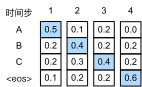
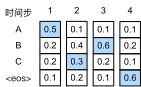
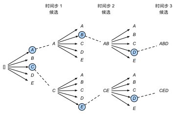

# 梁搜索
:label:`sec_beam-search`

在 :numref:`sec_seq2seq` 中，我们通过令牌预测输出序列令牌，直到 <eos> 预测特殊序列结束 “” 令牌。在本节中，我们将首先将这个 * 贪婪的搜索 * 策略形式化并探讨它的问题，然后将此策略与其他选择进行比较：
*详尽搜索 * 和 * 光束搜索 *.

在正式介绍贪婪搜索之前，让我们使用 :numref:`sec_seq2seq` 相同的数学符号正式化搜索问题。在任何时间步 $t'$，解码器输出 $y_{t'}$ 的概率取决于 $t'$ 之前的输出子序列 $y_1, \ldots, y_{t'-1}$ 和上下文变量 $\mathbf{c}$ 对输入序列的信息进行编码。要量化计算成本，请用 $\mathcal{Y}$（其中包含 <eos> “”）表示输出词汇。因此，这个词汇集的基数 $\left|\mathcal{Y}\right|$ 是词汇大小。让我们还将输出序列的最大标记数指定为 $T'$。因此，我们的目标是从所有 $\mathcal{O}(\left|\mathcal{Y}\right|^{T'})$ 可能的输出序列中寻找理想的输出。当然，对于所有这些输出序列，包括 “<eos>” 之后的部分将被丢弃在实际输出中。

## 贪婪搜索

首先，让我们来看一个简单的策略：* 贪婪的搜索 *。该策略已被用来预测 :numref:`sec_seq2seq` 中的序列。在贪婪搜索中，在输出序列的任何时间步骤 $t'$，我们搜索具有 $\mathcal{Y}$ 最高条件概率的令牌，即

$$y_{t'} = \operatorname*{argmax}_{y \in \mathcal{Y}} P(y \mid y_1, \ldots, y_{t'-1}, \mathbf{c}),$$

作为输出。输出 <eos> “” 或输出序列达到其最大长度 $T'$ 后，输出序列就完成。

那么贪婪的搜索可能会出错？事实上，* 最优序列 * 应该是最大值为 $\prod_{t'=1}^{T'} P(y_{t'} \mid y_1, \ldots, y_{t'-1}, \mathbf{c})$ 的输出序列，这是基于输入序列生成输出序列的条件概率。不幸的是，不能保证最佳序列将通过贪婪的搜索获得。

:label:`fig_s2s-prob1`

让我们用一个例子来说明这一点。假设 <eos> 输出字典中有四个标记 “A”、“B”、“C” 和 “”。在 :numref:`fig_s2s-prob1` 中，每个时间步长下的四个数字表示 <eos> 在该时间步长分别生成 “A”、“B”、“C” 和 “” 的条件概率。在每个时间步骤中，贪婪搜索都会选择具有最高条件概率的令牌。因此，<eos> 将在 :numref:`fig_s2s-prob1` 中预测输出序列 “A”、“B”、“C” 和 “”。此输出序列的条件概率为 $0.5\times0.4\times0.4\times0.6 = 0.048$。

:label:`fig_s2s-prob2`

接下来，让我们看看 :numref:`fig_s2s-prob2` 中的另一个例子。与 :numref:`fig_s2s-prob1` 不同，在时间步骤 2 中，我们在 :numref:`fig_s2s-prob2` 中选择令牌 “C”，它具有 * 秒 * 最高条件概率。由于时间步骤 3 所基于的时间步骤 1 和 2 的输出子序列已从 :numref:`fig_s2s-prob1` 中的 “A” 和 “B” 更改为 :numref:`fig_s2s-prob2` 中的 “A” 和 “C”，因此时间步骤 3 每个标记的条件概率也在 :numref:`fig_s2s-prob2` 中发生了变化。假设我们在时间步骤 3 选择令牌 “B”。现在，时间步骤 4 是以前三个时间步骤 “A”、“C” 和 “B” 为条件的输出子序列为条件的，这与 :numref:`fig_s2s-prob1` 中的 “A”、“B” 和 “C” 不同。因此，在 :numref:`fig_s2s-prob2` 的时间步骤 4 生成每个令牌的条件概率也与 :numref:`fig_s2s-prob1` 中的概率不同。因此，<eos> 在 :numref:`fig_s2s-prob2` 中输出序列 “A”、“C”、“B” 和 “” 的条件概率为 $0.5\times0.3 \times0.6\times0.6=0.054$，这比 :numref:`fig_s2s-prob1` 中贪婪搜索的概率大。在此示例中，<eos> 贪婪搜索获得的输出序列 “A”、“B”、“C” 和 “” 不是最佳序列。

## 详尽搜索

如果目标是获得最佳序列，我们可以考虑使用 * 全面搜索 *：用条件概率详尽枚举所有可能的输出序列，然后输出条件概率最高的序列。

虽然我们可以使用详尽的搜索来获得最佳序列，但其计算成本 $\mathcal{O}(\left|\mathcal{Y}\right|^{T'})$ 可能过高。例如，当 $|\mathcal{Y}|=10000$ 和 $T'=10$ 时，我们将需要评估 $10000^{10} = 10^{40}$ 序列。这是下一个不可能的！另一方面，贪婪搜索的计算成本为 $\mathcal{O}(\left|\mathcal{Y}\right|T')$：它通常比详尽搜索要小得多。例如，当 $|\mathcal{Y}|=10000$ 和 $T'=10$ 时，我们只需要评估 $10000\times10=10^5$ 序列。

## 梁搜索

关于序列搜索策略的决定取决于一个频谱，在任何一个极端都有简单的问题。如果只是准确性很重要呢？显然，详尽的搜索。如果只有计算成本很重要，该怎么办？显然，贪婪的搜索。一个现实世界的应用程序通常会提出一个复杂的问题，位于这两个极端之间。

*梁搜索 * 是贪婪搜索的改进版本。它有一个名为 * 光束大小 * 的超参数，$k$。
在时间步骤 1 中，我们选择具有最高条件概率的 $k$ 令牌。他们每个人都将分别是 $k$ 候选输出序列的第一个标记。在后续的每个时间步骤中，基于上一个时间步骤中的 $k$ 候选输出序列，我们继续选择 $k$ 候选输出序列，其条件概率最高。

:label:`fig_beam-search`

:numref:`fig_beam-search` 以实例展示了光束搜索过程。假设输出词汇仅包含五个元素：$\mathcal{Y} = \{A, B, C, D, E\}$，其中一个是 “<eos>”。让光束大小为 2，输出序列的最大长度为 3。在时间步骤 1 时，假设具有最高条件概率 $P(y_1 \mid \mathbf{c})$ 的令牌是 $A$ 和 $C$。在时间步骤 2，对于所有 $y_2 \in \mathcal{Y},$，我们计算

$$\begin{aligned}P(A, y_2 \mid \mathbf{c}) = P(A \mid \mathbf{c})P(y_2 \mid A, \mathbf{c}),\\ P(C, y_2 \mid \mathbf{c}) = P(C \mid \mathbf{c})P(y_2 \mid C, \mathbf{c}),\end{aligned}$$  

并选择这十个值中最大的两个值，例如 $P(A, B \mid \mathbf{c})$ 和 $P(C, E \mid \mathbf{c})$。然后，在时间步骤 3，对于所有 $y_3 \in \mathcal{Y}$，我们计算

$$\begin{aligned}P(A, B, y_3 \mid \mathbf{c}) = P(A, B \mid \mathbf{c})P(y_3 \mid A, B, \mathbf{c}),\\P(C, E, y_3 \mid \mathbf{c}) = P(C, E \mid \mathbf{c})P(y_3 \mid C, E, \mathbf{c}),\end{aligned}$$ 

并在这十个值中选择最大的两个值，例如：$P(A, B, D \mid \mathbf{c})$ 和 $P(C, E, D \mid  \mathbf{c}).$。因此，我们得到了六个候选人的输出序列：(一) 以及 (六)

最后，我们根据这六个序列获得一组最终候选输出序列（例如，丢弃包括 “<eos>” 之后的部分）。然后，我们选择以下分数中最高的序列作为输出序列：

$$ \frac{1}{L^\alpha} \log P(y_1, \ldots, y_{L}) = \frac{1}{L^\alpha} \sum_{t'=1}^L \log P(y_{t'} \mid y_1, \ldots, y_{t'-1}, \mathbf{c}),$$
:eqlabel:`eq_beam-search-score`

其中 $L$ 是最终候选序列的长度，$\alpha$ 通常设置为 0.75。由于较长的序列在 :eqref:`eq_beam-search-score` 的总和中具有更多的对数项，因此分母中的术语 $L^\alpha$ 会惩罚长序列。

光束搜索的计算成本为 $\mathcal{O}(k\left|\mathcal{Y}\right|T')$。这种结果是贪婪搜索和彻底搜索的结果之间的。事实上，贪婪搜索可以被视为一种特殊类型的光束搜索，光束大小为 1。通过灵活的光束尺寸选择，光束搜索可以在精度与计算成本之间进行权衡。

## 摘要

* 序列搜索策略包括贪婪搜索、详尽搜索和光束搜索。
* 梁搜索通过灵活选择光束尺寸，在精度与计算成本之间进行权衡。

## 练习

1. 我们能否将详尽搜索视为一种特殊类型的光束搜索？为什么还是为什么不呢？
1. 在 :numref:`sec_seq2seq` 机器翻译问题中应用光束搜索。光束尺寸如何影响平移结果和预测速度？
1. 我们使用语言建模来按照 :numref:`sec_rnn_scratch` 中的用户提供的前缀生成文本。它使用哪种搜索策略？你能改进它吗？

[Discussions](https://discuss.d2l.ai/t/338)
