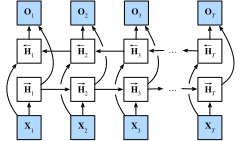

# 双向循环神经网络
:label:`sec_bi_rnn`

在顺序学习中，到目前为止，我们假设我们的目标是为下一个输出建模，例如，在时间序列上下文或语言模型的上下文中。虽然这是一个典型的情况，但这并不是我们可能遇到的唯一情况。为了说明这个问题，请考虑以下三个任务在文本序列中填写空白：

* 我是七十二九六十四
* 我饿了
* 我是 `___` 饿了，我可以吃半只猪。

根据可用信息的数量，我们可能会用非常不同的词语填写空白，例如 “快乐”、“不” 和 “非常”。显然，短语的末尾（如果有）会传达有关选择哪个词的重要信息。无法利用这一点的序列模型在相关任务上表现不佳。例如，在命名实体识别（例如，识别 “绿色” 是指 “Green 先生” 还是指颜色）方面做得很好，较长范围的上下文也同样重要。为了获得解决这个问题的灵感，让我们绕过概率图形模型。

## 隐马尔可夫模型中的动态规划

本小节用于说明动态编程问题。具体的技术细节对于了解深度学习模型并不重要，但它们有助于激励人们为什么可以使用深度学习，以及为什么人们可以选择特定的体系结构。

如果我们想使用概率图形模型来解决问题，我们可以设计一个潜在的变量模型，如下所示。在任何时间步骤 $t$，我们假设存在一些潜在变量 $h_t$ 来管理我们通过 $P(x_t \mid h_t)$ 观测到的排放量 $x_t$。此外，任何过渡 $h_t \to h_{t+1}$ 都是由某些状态转变概率 $P(h_{t+1} \mid h_{t})$ 给出的。然后，这个概率图形模型是一个 * 隐藏马尔科夫模型 *，如 :numref:`fig_hmm` 所示。


:label:`fig_hmm`

因此，对于 $T$ 观测值序列，我们在观测和隐藏状态上具有以下联合概率分布：

$$P(x_1, \ldots, x_T, h_1, \ldots, h_T) = \prod_{t=1}^T P(h_t \mid h_{t-1}) P(x_t \mid h_t), \text{ where } P(h_1 \mid h_0) = P(h_1).$$
:eqlabel:`eq_hmm_jointP`

现在假设我们观察到所有的 $x_i$，除了一些 $x_j$ 之外，这是我们的目标是计算 $P(x_j \mid x_{-j})$，其中 $x_{-j} = (x_1, \ldots, x_{j-1}, x_{j+1}, \ldots, x_{T})$。由于 $P(x_j \mid x_{-j})$ 中没有潜在变量，我们考虑总结 $h_1, \ldots, h_T$ 的所有可能的选择组合。如果任何 $h_i$ 都可以接受 $k$ 个不同的值（有限数量的状态），这意味着我们需要总结超过 $k^T$ 个条款-通常是不可能的！幸运的是，有一个优雅的解决方案：* 动态编程 *。

要了解它的工作原理，请考虑依次对潜在变量 $h_1, \ldots, h_T$ 进行求和。根据 :eqref:`eq_hmm_jointP` 号文件，这样做的结果是：

$$\begin{aligned}
    &P(x_1, \ldots, x_T) \\
    =& \sum_{h_1, \ldots, h_T} P(x_1, \ldots, x_T, h_1, \ldots, h_T) \\
    =& \sum_{h_1, \ldots, h_T} \prod_{t=1}^T P(h_t \mid h_{t-1}) P(x_t \mid h_t) \\
    =& \sum_{h_2, \ldots, h_T} \underbrace{\left[\sum_{h_1} P(h_1) P(x_1 \mid h_1) P(h_2 \mid h_1)\right]}_{\pi_2(h_2) \stackrel{\mathrm{def}}{=}}
    P(x_2 \mid h_2) \prod_{t=3}^T P(h_t \mid h_{t-1}) P(x_t \mid h_t) \\
    =& \sum_{h_3, \ldots, h_T} \underbrace{\left[\sum_{h_2} \pi_2(h_2) P(x_2 \mid h_2) P(h_3 \mid h_2)\right]}_{\pi_3(h_3)\stackrel{\mathrm{def}}{=}}
    P(x_3 \mid h_3) \prod_{t=4}^T P(h_t \mid h_{t-1}) P(x_t \mid h_t)\\
    =& \dots \\
    =& \sum_{h_T} \pi_T(h_T) P(x_T \mid h_T).
\end{aligned}$$

一般来说，我们有 * 前向递归 * 作为

$$\pi_{t+1}(h_{t+1}) = \sum_{h_t} \pi_t(h_t) P(x_t \mid h_t) P(h_{t+1} \mid h_t).$$

递归被初始化为 $\pi_1(h_1) = P(h_1)$。抽象地说，这可以写成 $\pi_{t+1} = f(\pi_t, x_t)$，其中 $f$ 是一些可学习的函数。这看起来非常像我们迄今为止在 RNS 上下文中讨论的潜在变量模型中的更新方程！

完全类似于前向递归，我们也可以用向后递归总结相同的潜在变量集。这产生：

$$\begin{aligned}
    & P(x_1, \ldots, x_T) \\
     =& \sum_{h_1, \ldots, h_T} P(x_1, \ldots, x_T, h_1, \ldots, h_T) \\
    =& \sum_{h_1, \ldots, h_T} \prod_{t=1}^{T-1} P(h_t \mid h_{t-1}) P(x_t \mid h_t) \cdot P(h_T \mid h_{T-1}) P(x_T \mid h_T) \\
    =& \sum_{h_1, \ldots, h_{T-1}} \prod_{t=1}^{T-1} P(h_t \mid h_{t-1}) P(x_t \mid h_t) \cdot
    \underbrace{\left[\sum_{h_T} P(h_T \mid h_{T-1}) P(x_T \mid h_T)\right]}_{\rho_{T-1}(h_{T-1})\stackrel{\mathrm{def}}{=}} \\
    =& \sum_{h_1, \ldots, h_{T-2}} \prod_{t=1}^{T-2} P(h_t \mid h_{t-1}) P(x_t \mid h_t) \cdot
    \underbrace{\left[\sum_{h_{T-1}} P(h_{T-1} \mid h_{T-2}) P(x_{T-1} \mid h_{T-1}) \rho_{T-1}(h_{T-1}) \right]}_{\rho_{T-2}(h_{T-2})\stackrel{\mathrm{def}}{=}} \\
    =& \ldots \\
    =& \sum_{h_1} P(h_1) P(x_1 \mid h_1)\rho_{1}(h_{1}).
\end{aligned}$$

因此，我们可以将 * 向后递归 * 写为

$$\rho_{t-1}(h_{t-1})= \sum_{h_{t}} P(h_{t} \mid h_{t-1}) P(x_{t} \mid h_{t}) \rho_{t}(h_{t}),$$

并进行初始化。向前递归和向后递归都使我们能够在 $\mathcal{O}(kT)$（线性）时间内对 $(h_1, \ldots, h_T)$ 的所有值（而不是指数时间）中超过 $T$ 个潜在变量进行总和。这是使用图形模型进行概率推理的巨大优势之一。它也是一般消息传递算法 :cite:`Aji.McEliece.2000` 的一个非常特殊的实例。结合前递归和后递归，我们能够计算

$$P(x_j \mid x_{-j}) \propto \sum_{h_j} \pi_j(h_j) \rho_j(h_j) P(x_j \mid h_j).$$

请注意，抽象地说，向后递归可以写成 $\rho_{t-1} = g(\rho_t, x_t)$，其中 $g$ 是一个可学习的函数。再次，这看起来非常像一个更新方程，只是向后运行，不像我们迄今为止在 RNS 中看到的那样。事实上，隐藏的马尔科夫模型在未来数据可用时会受益。信号处理科学家将知道和不知道未来观测值作为插值法与外推法加以区分。有关详细信息，请参阅本书中关于顺序蒙特卡洛算法的介绍章节 :cite:`Doucet.De-Freitas.Gordon.2001`。

## 双向模型

如果我们希望在 RNS 中拥有一个能够提供与隐藏马尔科夫模型相似的前瞻能力的机制，我们需要修改迄今为止我们已经看到的 RNN 设计。幸运的是，这在概念上很容易。我们不是仅在从第一个令牌开始的前进模式下运行 RNN，而是从最后一个令牌开始从后面运行到前面的另一个令牌。
*双向 RNNS* 添加了一个隐藏层，向后传递信息，以便更灵活地处理此类信息。:numref:`fig_birnn` 说明了具有单个隐藏层的双向 RNN 的体系结构。


:label:`fig_birnn`

事实上，这与隐藏马尔科夫模型的动态编程中的前向和后向递归并不太差异。主要区别在于，在前面的情况下，这些方程具有特定的统计意义。现在他们没有这种易于访问的解释，我们可以将它们视为通用和可学习的函数。这种转换体现了指导现代深度网络设计的许多原则：首先，使用经典统计模型的功能依赖性类型，然后以通用形式对其进行参数化。

### 定义

通过 :cite:`Schuster.Paliwal.1997` 引入了双向 RNs。有关各种体系结构的详细讨论，另请参阅第 :cite:`Graves.Schmidhuber.2005` 号文件。让我们来看看这样一个网络的具体情况。

对于任何时间步骤 $t$，给定一个小批量输入 $\mathbf{X}_t \in \mathbb{R}^{n \times d}$（例子数量：$n$，每个例子中的输入数量：$d$），并让隐藏层激活功能是 $\phi$。在双向架构中，我们假设此时间步长的前向和向后隐藏状态分别为 $\overrightarrow{\mathbf{H}}_t  \in \mathbb{R}^{n \times h}$ 和 $\overleftarrow{\mathbf{H}}_t  \in \mathbb{R}^{n \times h}$，其中 $h$ 是隐藏单位的数量。向前和向后隐藏状态更新如下所示：

$$
\begin{aligned}
\overrightarrow{\mathbf{H}}_t &= \phi(\mathbf{X}_t \mathbf{W}_{xh}^{(f)} + \overrightarrow{\mathbf{H}}_{t-1} \mathbf{W}_{hh}^{(f)}  + \mathbf{b}_h^{(f)}),\\
\overleftarrow{\mathbf{H}}_t &= \phi(\mathbf{X}_t \mathbf{W}_{xh}^{(b)} + \overleftarrow{\mathbf{H}}_{t+1} \mathbf{W}_{hh}^{(b)}  + \mathbf{b}_h^{(b)}),
\end{aligned}
$$

其中权重 $\mathbf{W}_{xh}^{(f)} \in \mathbb{R}^{d \times h}, \mathbf{W}_{hh}^{(f)} \in \mathbb{R}^{h \times h}, \mathbf{W}_{xh}^{(b)} \in \mathbb{R}^{d \times h}, \text{ and } \mathbf{W}_{hh}^{(b)} \in \mathbb{R}^{h \times h}$ 和偏置 $\mathbf{b}_h^{(f)} \in \mathbb{R}^{1 \times h} \text{ and } \mathbf{b}_h^{(b)} \in \mathbb{R}^{1 \times h}$ 都是模型参数。

接下来，我们将向前和向后隐藏状态连接到 $\overrightarrow{\mathbf{H}}_t$ 和 $\overleftarrow{\mathbf{H}}_t$，以获得要馈入输出层的隐藏状态 $\mathbf{H}_t \in \mathbb{R}^{n \times 2h}$。在具有多个隐藏层的深度双向 RNS 中，此类信息将作为 * 输入 * 传递到下一个双向层。最后，输出层计算输出 $\mathbf{O}_t \in \mathbb{R}^{n \times q}$（输出数量：$q$）：

$$\mathbf{O}_t = \mathbf{H}_t \mathbf{W}_{hq} + \mathbf{b}_q.$$

在这里，权重矩阵 $\mathbf{W}_{hq} \in \mathbb{R}^{2h \times q}$ 和偏置 $\mathbf{b}_q \in \mathbb{R}^{1 \times q}$ 是输出层的模型参数。事实上，两个方向可以有不同数量的隐藏单位。

### 计算成本和应用

双向 RNN 的主要特征之一是，序列两端的信息用于估计输出。也就是说，我们使用来自未来和过去观测的信息来预测当前的观测值。在下一个令牌预测的情况下，这不是我们想要的。毕竟，在预测下一个令牌时，我们没有知道下一个令牌旁边的奢侈品。因此，如果我们天真地使用双向 RNN，我们不会得到很好的准确性：在训练过程中，我们有过去和未来的数据来估计目前。在测试期间，我们只有过去的数据，因此准确性很差。我们将在下面的一个实验中说明这一点。

为了增加对伤害的侮辱，双向 RNs 也非常缓慢。造成这种情况的主要原因是，正向传播需要双向层中的向前递归和向后递归，并且反向传播取决于正向传播的结果。因此，渐变将具有非常长的依赖链。

在实践中，双向层非常谨慎地使用，并且仅用于一组狭窄的应用程序，例如填写缺失的单词、注释令牌（例如，用于命名实体识别）以及批发编码序列作为序列处理管道中的一个步骤（例如，用于机器翻译）。在 :numref:`sec_bert` 和 :numref:`sec_sentiment_rnn` 中，我们将介绍如何使用双向 RNs 来编码文本序列。

## 针对错误应用程序训练双向 RNN

如果我们忽略了有关双向 RNs 使用过去和未来的数据并将其应用于语言模型这一事实的所有建议，我们将得到可接受的困惑估计值。尽管如此，如下面的实验所示，模型预测未来令牌的能力受到严重影响。尽管有合理的困惑，但即使经过多次迭代，它也只会产生乱码。我们将下面的代码作为警告示例，不要在错误的上下文中使用它们。

```{.python .input}
from d2l import mxnet as d2l
from mxnet import npx
from mxnet.gluon import rnn
npx.set_np()

# Load data
batch_size, num_steps, device = 32, 35, d2l.try_gpu()
train_iter, vocab = d2l.load_data_time_machine(batch_size, num_steps)
# Define the bidirectional LSTM model by setting `bidirectional=True`
vocab_size, num_hiddens, num_layers = len(vocab), 256, 2
lstm_layer = rnn.LSTM(num_hiddens, num_layers, bidirectional=True)
model = d2l.RNNModel(lstm_layer, len(vocab))
# Train the model
num_epochs, lr = 500, 1
d2l.train_ch8(model, train_iter, vocab, lr, num_epochs, device)
```

```{.python .input}
#@tab pytorch
from d2l import torch as d2l
import torch
from torch import nn

# Load data
batch_size, num_steps, device = 32, 35, d2l.try_gpu()
train_iter, vocab = d2l.load_data_time_machine(batch_size, num_steps)
# Define the bidirectional LSTM model by setting `bidirectional=True`
vocab_size, num_hiddens, num_layers = len(vocab), 256, 2
num_inputs = vocab_size
lstm_layer = nn.LSTM(num_inputs, num_hiddens, num_layers, bidirectional=True)
model = d2l.RNNModel(lstm_layer, len(vocab))
model = model.to(device)
# Train the model
num_epochs, lr = 500, 1
d2l.train_ch8(model, train_iter, vocab, lr, num_epochs, device)
```

由于上述原因，产出显然不能令人满意。有关更有效地使用双向 RNs 的讨论，请参阅 :numref:`sec_sentiment_rnn` 中的情绪分析应用程序。

## 摘要

* 在双向 RNS 中，每个时间步长的隐藏状态由当前时间步长前后的数据同时确定。
* 在概率图形模型中，双向 RNs 与前向向后算法具有惊人的相似性。
* 双向 RNs 主要用于序列编码和双向上下文的观测值估计。
* 由于梯度链长，双向 RNs 的训练成本非常高。

## 练习

1. 如果不同的方向使用不同数量的隐藏单位，$\mathbf{H}_t$ 的形状将如何改变？
1. 设计具有多个隐藏层的双向 RNN。
1. 多边关系在自然语言中是常见的。例如，单词 “银行” 在上下文中有不同的含义 “我去银行存款现金” 和 “我去银行坐下”。我们如何设计一个神经网络模型，以便给定一个上下文序列和一个单词，将返回上下文中单词的矢量表示？什么类型的神经架构适用于处理多边化？

:begin_tab:`mxnet`
[Discussions](https://discuss.d2l.ai/t/339)
:end_tab:

:begin_tab:`pytorch`
[Discussions](https://discuss.d2l.ai/t/1059)
:end_tab:
