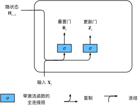
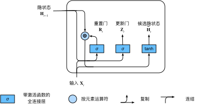

# 门控循环单位 (GRU)
:label:`sec_gru`

在 :numref:`sec_bptt` 中，我们讨论了如何在 RNS 中计算梯度。特别是我们发现，长的产品的矩阵可能会导致消失或爆炸的梯度。让我们简单地思考一下这种梯度异常在实践中意味着什么：

* 我们可能会遇到一种情况，即早期观测对于预测未来所有观测非常重要。考虑一下有点人为的情况，其中第一个观察包含一个校验和，目标是判断序列末尾的校验和是否正确。在这种情况下，第一个令牌的影响是至关重要的。我们希望有一些机制将重要的早期信息存储在 * 内存单元 * 中。如果没有这样的机制，我们将不得不为这个观测指定一个非常大的梯度，因为它会影响所有后续观测值。
* 我们可能会遇到一些令牌没有相关观察的情况。例如，在解析网页时，可能会有一些辅助 HTML 代码，这些代码与评估页面上传达的情绪无关。我们希望在潜在状态表示中有一些 * 滑动 * 这样的令牌的机制。
* 我们可能会遇到序列各部分之间存在逻辑断裂的情况。例如，一本书中的章节之间可能有过渡，或者在证券的熊市和牛市之间的过渡。在这种情况下，有一种 * 重置 * 我们的内部状态表示的方法将是很好的。

已经提出了一些解决这一问题的方法。其中最早的一个是长短期记忆 :cite:`Hochreiter.Schmidhuber.1997`，我们将在 :numref:`sec_lstm` 中讨论。门控循环单元 (GRU) :cite:`Cho.Van-Merrienboer.Bahdanau.ea.2014` 是一个稍微简化的变体，通常提供类似的性能，并且计算 :cite:`Chung.Gulcehre.Cho.ea.2014` 的速度要快得多。由于它的简单性，让我们从 GRU 开始。

## 门控隐藏状态

香草 RNS 和 GRU 之间的关键区别在于后者支持隐藏状态的门控。这意味着我们有专门的机制，用于何时隐藏状态应为 * 更新 *，以及何时应该是 * 重置 *。这些机制已经得到了学习，它们解决了上述关切问题。例如，如果第一个标记非常重要，我们将学会在第一个观察后不更新隐藏状态。同样，我们将学会跳过无关紧要的临时观察。最后，我们将学会在需要时重置潜在状态。我们在下面详细讨论这个问题。

### 重置门和更新门

我们需要介绍的第一件事是 * 重置网关 * 和 * 更新网关 *。我们将它们设计为带有 $(0, 1)$ 条目的矢量，以便我们可以执行凸组合。例如，复位门将允许我们控制以前的状态，我们可能仍然希望记住的程度。同样，更新门将允许我们控制多少新状态只是旧状态的副本。

我们从设计这些门开始。:numref:`fig_gru_1` 说明了 GRU 中复位和更新门的输入，考虑到当前时间步长的输入和前一时间步长的隐藏状态。两个门的输出由两个具有 sigmoid 激活功能的完全连接层给出。


:label:`fig_gru_1`

在数学上，对于给定的时间步长 $t$，假设输入是一个微型批次 $\mathbf{X}_t \in \mathbb{R}^{n \times d}$（示例数量：$n$，输入数量：$d$），并且前一个时间步长的隐藏状态是 $\mathbf{H}_{t-1} \in \mathbb{R}^{n \times h}$（隐藏单位数量：$h$）。然后，重置门 $\mathbf{R}_t \in \mathbb{R}^{n \times h}$ 和更新门 $\mathbf{Z}_t \in \mathbb{R}^{n \times h}$ 的计算方法如下：

$$
\begin{aligned}
\mathbf{R}_t = \sigma(\mathbf{X}_t \mathbf{W}_{xr} + \mathbf{H}_{t-1} \mathbf{W}_{hr} + \mathbf{b}_r),\\
\mathbf{Z}_t = \sigma(\mathbf{X}_t \mathbf{W}_{xz} + \mathbf{H}_{t-1} \mathbf{W}_{hz} + \mathbf{b}_z),
\end{aligned}
$$

其中 $\mathbf{W}_{xr}, \mathbf{W}_{xz} \in \mathbb{R}^{d \times h}$ 和 $\mathbf{W}_{hr}, \mathbf{W}_{hz} \in \mathbb{R}^{h \times h}$ 是重量参数，而 $\mathbf{b}_r, \mathbf{b}_z \in \mathbb{R}^{1 \times h}$ 则是偏差。我们使用符号函数（如 :numref:`sec_mlp` 中引入的）将输入值转换为间隔 $(0, 1)$。

### 候选隐藏状态

接下来，让我们将复位门 $\mathbf{R}_t$ 与常规潜在状态更新机制集成在 :eqref:`rnn_h_with_state` 中。它导致以下
*候选隐藏状态 *
在时间步骤中执行以下操作：

$$\tilde{\mathbf{H}}_t = \tanh(\mathbf{X}_t \mathbf{W}_{xh} + \left(\mathbf{R}_t \odot \mathbf{H}_{t-1}\right) \mathbf{W}_{hh} + \mathbf{b}_h),$$
:eqlabel:`gru_tilde_H`

其中 $\mathbf{W}_{xh} \in \mathbb{R}^{d \times h}$ 和 $\mathbf{W}_{hh} \in \mathbb{R}^{h \times h}$ 是重量参数，$\mathbf{b}_h \in \mathbb{R}^{1 \times h}$ 是偏置，符号 $\odot$ 是哈达玛（元素）产品运算符。在这里，我们使用以 tanh 形式的非线性，以确保候选隐藏状态中的值保持在区间 $(-1, 1)$。

结果是一个 * 候选 *，因为我们仍然需要纳入更新门的操作。与 :eqref:`rnn_h_with_state` 相比，现在可以通过在 :eqref:`gru_tilde_H` 中的元素乘法和 $\mathbf{R}_t$ 和 $\mathbf{H}_{t-1}$ 的元素乘法降低以前状态的影响。每当重置门 $\mathbf{R}_t$ 的条目接近 1 时，我们会恢复一个香草 RNN，例如 :eqref:`rnn_h_with_state`。对于接近 0 的复位门 $\mathbf{R}_t$ 的所有条目，候选隐藏状态是以 $\mathbf{X}_t$ 作为输入的 MLP 的结果。因此，任何预先存在的隐藏状态都将 * 重置 * 为默认值。

:numref:`fig_gru_2` 说明了应用复位门后的计算流程。


:label:`fig_gru_2`

### 隐藏状态

最后，我们需要纳入更新门 $\mathbf{Z}_t$ 的效果。这决定了新的隐藏状态 $\mathbf{H}_t \in \mathbb{R}^{n \times h}$ 在多大程度上只是旧状态 $\mathbf{H}_{t-1}$，以及使用新候选状态 $\tilde{\mathbf{H}}_t$ 的程度。更新门 $\mathbf{Z}_t$ 可用于此目的，只需在 $\mathbf{H}_{t-1}$ 和 $\tilde{\mathbf{H}}_t$ 之间采用元素凸组合即可。这导致了 GRU 的最终更新方程：

$$\mathbf{H}_t = \mathbf{Z}_t \odot \mathbf{H}_{t-1}  + (1 - \mathbf{Z}_t) \odot \tilde{\mathbf{H}}_t.$$

每当更新门 $\mathbf{Z}_t$ 接近 1 时，我们只需保留旧状态。在这种情况下，$\mathbf{X}_t$ 的信息基本上被忽略，从而有效地跳过依赖链中的时间步骤 $t$。相比之下，每当 $\mathbf{Z}_t$ 接近 0 时，新的潜在状态 $\mathbf{H}_t$ 接近候选潜在状态 $\tilde{\mathbf{H}}_t$。这些设计可以帮助我们应对 RNS 中消失的梯度问题，并更好地捕获具有较大时间步长距离的序列的依赖关系。例如，如果更新门在整个子序列的所有时间步长都接近 1，则无论子序列的长度如何，开始时间步长处的旧隐藏状态将很容易保留并传递到其末尾。

:numref:`fig_gru_3` 说明了更新门启动后的计算流程。


:label:`fig_gru_3`

总而言之，GRU 具有以下两个显著特征：

* 重置门限有助于捕获序列中的短期依赖关系。
* 更新门有助于捕获序列中的长期依赖关系。

## 从头开始实施

为了更好地理解 GRU 模型，让我们从头开始实施它。我们首先阅读我们在 :numref:`sec_rnn_scratch` 中使用的时间机器数据集。下面给出了用于读取数据集的代码。

```{.python .input}
from d2l import mxnet as d2l
from mxnet import np, npx
from mxnet.gluon import rnn
npx.set_np()

batch_size, num_steps = 32, 35
train_iter, vocab = d2l.load_data_time_machine(batch_size, num_steps)
```

```{.python .input}
#@tab pytorch
from d2l import torch as d2l
import torch
from torch import nn

batch_size, num_steps = 32, 35
train_iter, vocab = d2l.load_data_time_machine(batch_size, num_steps)
```

### 初始化模型参数

下一步是初始化模型参数。我们从标准差为 0.01 的高斯分布中绘制权重，并将偏置设置为 0。超参数 `num_hiddens` 定义了隐藏单位的数量。我们实例化与更新门、复位门、候选隐藏状态和输出层相关的所有权重和偏差。

```{.python .input}
def get_params(vocab_size, num_hiddens, device):
    num_inputs = num_outputs = vocab_size

    def normal(shape):
        return np.random.normal(scale=0.01, size=shape, ctx=device)

    def three():
        return (normal((num_inputs, num_hiddens)),
                normal((num_hiddens, num_hiddens)),
                np.zeros(num_hiddens, ctx=device))

    W_xz, W_hz, b_z = three()  # Update gate parameters
    W_xr, W_hr, b_r = three()  # Reset gate parameters
    W_xh, W_hh, b_h = three()  # Candidate hidden state parameters
    # Output layer parameters
    W_hq = normal((num_hiddens, num_outputs))
    b_q = np.zeros(num_outputs, ctx=device)
    # Attach gradients
    params = [W_xz, W_hz, b_z, W_xr, W_hr, b_r, W_xh, W_hh, b_h, W_hq, b_q]
    for param in params:
        param.attach_grad()
    return params
```

```{.python .input}
#@tab pytorch
def get_params(vocab_size, num_hiddens, device):
    num_inputs = num_outputs = vocab_size

    def normal(shape):
        return torch.randn(size=shape, device=device)*0.01

    def three():
        return (normal((num_inputs, num_hiddens)),
                normal((num_hiddens, num_hiddens)),
                d2l.zeros(num_hiddens, device=device))

    W_xz, W_hz, b_z = three()  # Update gate parameters
    W_xr, W_hr, b_r = three()  # Reset gate parameters
    W_xh, W_hh, b_h = three()  # Candidate hidden state parameters
    # Output layer parameters
    W_hq = normal((num_hiddens, num_outputs))
    b_q = d2l.zeros(num_outputs, device=device)
    # Attach gradients
    params = [W_xz, W_hz, b_z, W_xr, W_hr, b_r, W_xh, W_hh, b_h, W_hq, b_q]
    for param in params:
        param.requires_grad_(True)
    return params
```

### 定义模型

现在我们将定义隐藏状态初始化函数 `init_gru_state`。就像 :numref:`sec_rnn_scratch` 中定义的 `init_rnn_state` 函数一样，此函数返回一个形状（批量大小，隐藏单位数）的张量，其值全部为零。

```{.python .input}
def init_gru_state(batch_size, num_hiddens, device):
    return (np.zeros(shape=(batch_size, num_hiddens), ctx=device), )
```

```{.python .input}
#@tab pytorch
def init_gru_state(batch_size, num_hiddens, device):
    return (torch.zeros((batch_size, num_hiddens), device=device), )
```

现在，我们已经准备好定义 GRU 模型了。它的结构与基本 RNN 单元的结构相同，只是更新方程更复杂。

```{.python .input}
def gru(inputs, state, params):
    W_xz, W_hz, b_z, W_xr, W_hr, b_r, W_xh, W_hh, b_h, W_hq, b_q = params
    H, = state
    outputs = []
    for X in inputs:
        Z = npx.sigmoid(np.dot(X, W_xz) + np.dot(H, W_hz) + b_z)
        R = npx.sigmoid(np.dot(X, W_xr) + np.dot(H, W_hr) + b_r)
        H_tilda = np.tanh(np.dot(X, W_xh) + np.dot(R * H, W_hh) + b_h)
        H = Z * H + (1 - Z) * H_tilda
        Y = np.dot(H, W_hq) + b_q
        outputs.append(Y)
    return np.concatenate(outputs, axis=0), (H,)
```

```{.python .input}
#@tab pytorch
def gru(inputs, state, params):
    W_xz, W_hz, b_z, W_xr, W_hr, b_r, W_xh, W_hh, b_h, W_hq, b_q = params
    H, = state
    outputs = []
    for X in inputs:
        Z = torch.sigmoid((X @ W_xz) + (H @ W_hz) + b_z)
        R = torch.sigmoid((X @ W_xr) + (H @ W_hr) + b_r)
        H_tilda = torch.tanh((X @ W_xh) + ((R * H) @ W_hh) + b_h)
        H = Z * H + (1 - Z) * H_tilda
        Y = H @ W_hq + b_q
        outputs.append(Y)
    return torch.cat(outputs, dim=0), (H,)
```

### 训练和预测

培训和预测工作方式与 :numref:`sec_rnn_scratch` 号文件完全相同。训练结束后，我们将分别打印出训练集和预测序列上的困惑，并按照提供的前缀 “时间旅行者” 和 “旅行者”，分别打印出来。

```{.python .input}
#@tab all
vocab_size, num_hiddens, device = len(vocab), 256, d2l.try_gpu()
num_epochs, lr = 500, 1
model = d2l.RNNModelScratch(len(vocab), num_hiddens, device, get_params,
                            init_gru_state, gru)
d2l.train_ch8(model, train_iter, vocab, lr, num_epochs, device)
```

## 简明实施

在高级 API 中，我们可以直接实例化 GPU 模型。这封装了我们在上面明确说明的所有配置细节。代码要快得多，因为它使用编译的运算符而不是 Python 来获得我们之前拼写的许多细节。

```{.python .input}
gru_layer = rnn.GRU(num_hiddens)
model = d2l.RNNModel(gru_layer, len(vocab))
d2l.train_ch8(model, train_iter, vocab, lr, num_epochs, device)
```

```{.python .input}
#@tab pytorch
num_inputs = vocab_size
gru_layer = nn.GRU(num_inputs, num_hiddens)
model = d2l.RNNModel(gru_layer, len(vocab))
model = model.to(device)
d2l.train_ch8(model, train_iter, vocab, lr, num_epochs, device)
```

## 摘要

* 门控 RNN 可以更好地捕获具有较大时间步长距离的序列的依赖关系。
* 重置门限有助于捕获序列中的短期依赖关系。
* 更新门有助于捕获序列中的长期依赖关系。
* 当复位门打开时，GRU 包含基本 RNs 作为极端情况。它们也可以通过打开更新门跳过子序列。

## 练习

1. 假设我们只想使用时间步长 $t'$ 的输入来预测时间步长 $t > t'$ 的输出。每个时间步长的重置和更新门的最佳值是什么？
1. 调整超参数并分析它们对运行时间、困惑度和输出序列的影响。
1. 相互比较 `rnn.RNN` 和 `rnn.GRU` 实现的运行时、困惑和输出字符串。
1. 如果您只实现 GRU 的部分，例如，仅使用复位门或仅使用更新门，会发生什么情况？

:begin_tab:`mxnet`
[Discussions](https://discuss.d2l.ai/t/342)
:end_tab:

:begin_tab:`pytorch`
[Discussions](https://discuss.d2l.ai/t/1056)
:end_tab:
