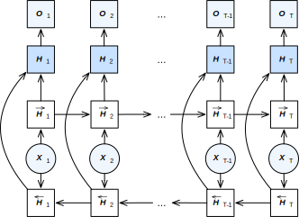

# 双向循环神经网络

下面我们介绍双向循环神经网络的架构。

给定时间步$t$的小批量输入$\boldsymbol{X}_t \in \mathbb{R}^{n \times x}$（样本数为$n$，输入个数为$x$）和隐藏层激活函数为$\phi$。在双向架构中，
设该时间步正向隐藏状态为$\overrightarrow{\boldsymbol{H}}_t  \in \mathbb{R}^{n \times h}$（正向隐藏单元个数为$h$），
反向隐藏状态为$\overleftarrow{\boldsymbol{H}}_t  \in \mathbb{R}^{n \times h}$（反向隐藏单元个数为$h$）。我们可以分别计算正向和反向隐藏状态：

$$
\begin{aligned}
\overrightarrow{\boldsymbol{H}}_t &= \phi(\boldsymbol{X}_t \boldsymbol{W}_{xh}^{(f)} + \overrightarrow{\boldsymbol{H}}_{t-1} \boldsymbol{W}_{hh}^{(f)}  + \boldsymbol{b}_h^{(f)}),\\
\overleftarrow{\boldsymbol{H}}_t &= \phi(\boldsymbol{X}_t \boldsymbol{W}_{xh}^{(b)} + \overleftarrow{\boldsymbol{H}}_{t+1} \boldsymbol{W}_{hh}^{(b)}  + \boldsymbol{b}_h^{(b)}),
\end{aligned}
$$

其中权重$\boldsymbol{W}_{xh}^{(f)} \in \mathbb{R}^{x \times h}, \boldsymbol{W}_{hh}^{(f)} \in \mathbb{R}^{h \times h}, \boldsymbol{W}_{xh}^{(b)} \in \mathbb{R}^{x \times h}, \boldsymbol{W}_{hh}^{(b)} \in \mathbb{R}^{h \times h}$和偏差 $\boldsymbol{b}_h^{(f)} \in \mathbb{R}^{1 \times h}, \boldsymbol{b}_h^{(b)} \in \mathbb{R}^{1 \times h}$均为模型参数。

双向循环神经网络在时间步$t$的隐藏状态$\boldsymbol{H}_t \in \mathbb{R}^{n \times 2h}$即连结$\overrightarrow{\boldsymbol{H}}_t$和$\overleftarrow{\boldsymbol{H}}_t$的结果。

最终，输出层的输出只需基于隐藏状态$\boldsymbol{H}_t \in \mathbb{R}^{n \times 2h}$：

$$\boldsymbol{O}_t = \boldsymbol{H}_t^{(L)} \boldsymbol{W}_{hy} + \boldsymbol{b}_y,$$

其中权重$\boldsymbol{W}_{hy} \in \mathbb{R}^{2h \times y}$和偏差$\boldsymbol{b}_y \in \mathbb{R}^{1 \times y}$为输出层的模型参数。

双向循环神经网络结构如图6.4所示。我们将在“自然语言处理”篇章中实验双向循环神经网络。

## 小结

* 我们可以在

## 练习

* 

## 扫码直达[讨论区](https://discuss.gluon.ai/t/topic/6732)

